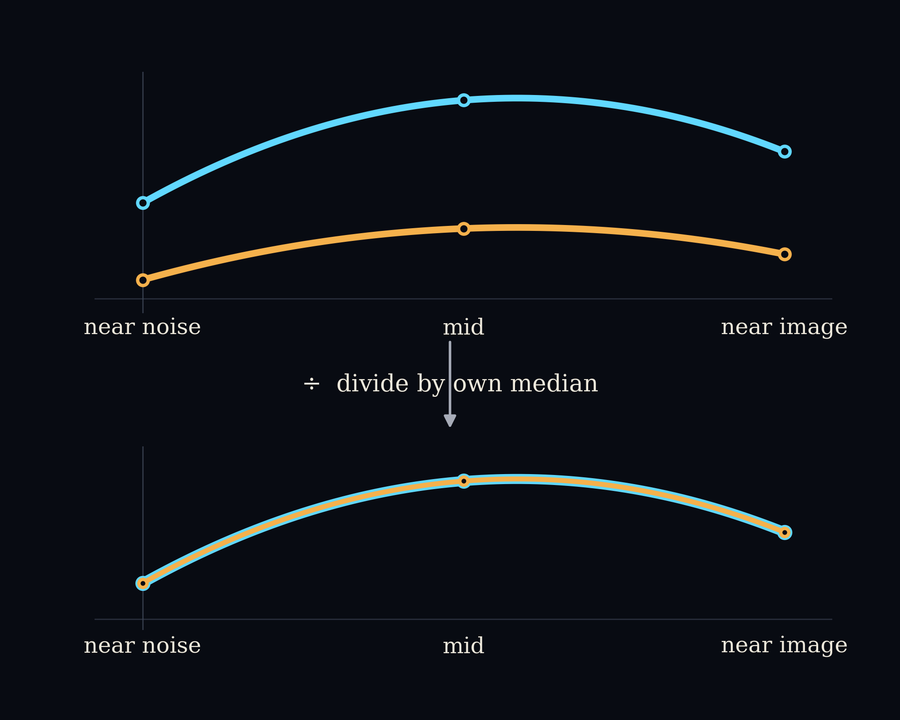

# A worked example: the two-stage normalization behind F3

> [!aside]
> Every number on this page is invented. None of it is real experimental output. It exists to make the arithmetic in `scripts/correction_size_vs_run_position.py` concrete before piece 2 of the F3 explanation continues. The real figure is at [`paper/iclr/figures/correction-size-over-the-denoising-run-across-17-pairs.png`](../../paper/iclr/figures/correction-size-over-the-denoising-run-across-17-pairs.png).

Piece 1 of the F3 explanation ("the two axes") stated the rule in words: F3's real quantity is the relative correction size, the norm of the correction vector $r_t$ divided by the norm of the product-of-experts prediction $\varepsilon_{\mathrm{PoE}}$, computed at every denoising step. Before that number gets pooled across pairs into the figure's population bands, each pair's own curve is divided a second time, by its own median across steps. This page runs that arithmetic on four toy pairs so the two divisions are visible as numbers, not just as a rule.

## The two definitions this example applies

**(1) The raw ratio, per pair and per step**

$$\rho_p(s) = \frac{\lVert r_t^{(p)}(s) \rVert}{\lVert \varepsilon_{\mathrm{PoE}}(s) \rVert}$$

where $p$ indexes the pair and $s$ indexes the denoising step.

**(2) The pair-normalized value**

$$\tilde\rho_p(s) = \frac{\rho_p(s)}{m_p}, \qquad m_p = \mathrm{median}_s\, \rho_p(s)$$

$m_p$ is pair $p$'s own median raw ratio across its steps. Dividing by it is the second normalization: the one that lets pairs with completely different raw scales stack into the same set of bands.

## The setup: four toy pairs, three toy steps

Each pair carries a correction vector $r_t \in \mathbb{R}^3$ at three toy denoising steps, standing in for near noise, mid, and near image.

> [!aside]
> The real $\varepsilon_{\mathrm{PoE}}$ varies from step to step. Here it is held fixed at the same vector for every pair and every step. That is a simplification made only for this page: it isolates what $r_t$'s own normalization does, without the denominator also moving.

$$\varepsilon_{\mathrm{PoE}} = (3, 4, 0), \qquad \lVert \varepsilon_{\mathrm{PoE}} \rVert = \sqrt{3^2 + 4^2 + 0^2} = \sqrt{25} = 5$$

| Pair | Step A (near noise) | Step B (mid) | Step C (near image) |
|---|---|---|---|
| 1 | $(1,2,2)$ | $(3,4,0)$ | $(0,0,4)$ |
| 2 | $(2,4,4)$ | $(6,8,0)$ | $(0,0,8)$ |
| 3 | $(3,4,0)$ | $(0,3,4)$ | $(0,0,4)$ |
| 4 | $(1,2,2)$ | $(3,4,12)$ | $(3,4,0)$ |

## Step 1: the norm of each vector

> [!example]
> **Pair 1**
> $$\lVert r_t^{(1)}(A) \rVert = \sqrt{1^2+2^2+2^2} = \sqrt{9} = 3$$
> $$\lVert r_t^{(1)}(B) \rVert = \sqrt{3^2+4^2+0^2} = \sqrt{25} = 5$$
> $$\lVert r_t^{(1)}(C) \rVert = \sqrt{0^2+0^2+4^2} = \sqrt{16} = 4$$

> [!example]
> **Pair 2**
> $$\lVert r_t^{(2)}(A) \rVert = \sqrt{2^2+4^2+4^2} = \sqrt{36} = 6$$
> $$\lVert r_t^{(2)}(B) \rVert = \sqrt{6^2+8^2+0^2} = \sqrt{100} = 10$$
> $$\lVert r_t^{(2)}(C) \rVert = \sqrt{0^2+0^2+8^2} = \sqrt{64} = 8$$

> [!example]
> **Pair 3**
> $$\lVert r_t^{(3)}(A) \rVert = \sqrt{3^2+4^2+0^2} = \sqrt{25} = 5$$
> $$\lVert r_t^{(3)}(B) \rVert = \sqrt{0^2+3^2+4^2} = \sqrt{25} = 5$$
> $$\lVert r_t^{(3)}(C) \rVert = \sqrt{0^2+0^2+4^2} = \sqrt{16} = 4$$

> [!example]
> **Pair 4**
> $$\lVert r_t^{(4)}(A) \rVert = \sqrt{1^2+2^2+2^2} = \sqrt{9} = 3$$
> $$\lVert r_t^{(4)}(B) \rVert = \sqrt{3^2+4^2+12^2} = \sqrt{169} = 13$$
> $$\lVert r_t^{(4)}(C) \rVert = \sqrt{3^2+4^2+0^2} = \sqrt{25} = 5$$

## Step 2: the raw ratio, equation (1) applied

Every norm above divides by the fixed $\lVert \varepsilon_{\mathrm{PoE}} \rVert = 5$.

| Pair | $\rho_p(A)$ | $\rho_p(B)$ | $\rho_p(C)$ |
|---|---|---|---|
| 1 | $3/5 = 0.6$ | $5/5 = 1.0$ | $4/5 = 0.8$ |
| 2 | $6/5 = 1.2$ | $10/5 = 2.0$ | $8/5 = 1.6$ |
| 3 | $5/5 = 1.0$ | $5/5 = 1.0$ | $4/5 = 0.8$ |
| 4 | $3/5 = 0.6$ | $13/5 = 2.6$ | $5/5 = 1.0$ |

Pair 1 sits between 0.6 and 1.0. Pair 2 sits between 1.2 and 2.0. Same three-step arc, twice the scale.

## Step 3: each pair's own median

A median of three sorted numbers is the middle one.

> [!example]
> Pair 1: sorted $\{0.6, 0.8, 1.0\}$, so $m_1 = 0.8$.
> Pair 2: sorted $\{1.2, 1.6, 2.0\}$, so $m_2 = 1.6$.
> Pair 3: sorted $\{0.8, 1.0, 1.0\}$, so $m_3 = 1.0$.
> Pair 4: sorted $\{0.6, 1.0, 2.6\}$, so $m_4 = 1.0$.

## Step 4: the normalized value, equation (2) applied

> [!example]
> **Pair 1**, dividing by $m_1 = 0.8$:
> $$\tilde\rho_1(A) = \frac{0.6}{0.8} = 0.75, \quad \tilde\rho_1(B) = \frac{1.0}{0.8} = 1.25, \quad \tilde\rho_1(C) = \frac{0.8}{0.8} = 1.0$$

> [!example]
> **Pair 2**, dividing by $m_2 = 1.6$:
> $$\tilde\rho_2(A) = \frac{1.2}{1.6} = 0.75, \quad \tilde\rho_2(B) = \frac{2.0}{1.6} = 1.25, \quad \tilde\rho_2(C) = \frac{1.6}{1.6} = 1.0$$

> [!example]
> **Pair 3**, dividing by $m_3 = 1.0$:
> $$\tilde\rho_3(A) = \frac{1.0}{1.0} = 1.0, \quad \tilde\rho_3(B) = \frac{1.0}{1.0} = 1.0, \quad \tilde\rho_3(C) = \frac{0.8}{1.0} = 0.8$$

> [!example]
> **Pair 4**, dividing by $m_4 = 1.0$:
> $$\tilde\rho_4(A) = \frac{0.6}{1.0} = 0.6, \quad \tilde\rho_4(B) = \frac{2.6}{1.0} = 2.6, \quad \tilde\rho_4(C) = \frac{1.0}{1.0} = 1.0$$

## The punchline: two pairs, one shape

Pair 1's raw ratio ran 0.6 to 1.0. Pair 2's raw ratio ran 1.2 to 2.0, a completely different scale. After each pair divides by its own median:

$$\tilde\rho_1 = (0.75,\ 1.25,\ 1.0) \qquad \tilde\rho_2 = (0.75,\ 1.25,\ 1.0)$$

Identical. The two pairs never had the same correction size, but they had the same shape across the three steps, low at the noisy end, a peak in the middle, settling back down near the image. Equation (2) is the step that throws away each pair's private scale and keeps only that shape. This is the mechanism the real F3 figure depends on: it pools 17 pairs with 17 different raw scales, and it can only stack them into one set of bands because every pair has already been divided down to its own shape first.

## Step 5: the population median across the four pairs

The real figure's black median line is this operation, run at every step across all pairs it pools. With four pairs the median of four numbers is the average of the two middle values once they are sorted, not a single middle element the way it was for three.

> [!example]
> **Step A**, the four pairs' normalized values: $0.75, 0.75, 1.0, 0.6$. Sorted: $0.6, 0.75, 0.75, 1.0$. The two middle values are both $0.75$, so the population median is
> $$M(A) = \frac{0.75+0.75}{2} = 0.75$$
>
> **Step B**, the four pairs' normalized values: $1.25, 1.25, 1.0, 2.6$. Sorted: $1.0, 1.25, 1.25, 2.6$. The two middle values are both $1.25$, so
> $$M(B) = \frac{1.25+1.25}{2} = 1.25$$
>
> **Step C**, the four pairs' normalized values: $1.0, 1.0, 0.8, 1.0$. Sorted: $0.8, 1.0, 1.0, 1.0$. The two middle values are both $1.0$, so
> $$M(C) = \frac{1.0+1.0}{2} = 1.0$$

The toy population median runs $0.75 \to 1.25 \to 1.0$: low near noise, a peak in the middle, settling back down near the image. That is the same low-then-rise-then-settle shape the real F3 median line carries, at toy scale.

> [!aside]
> F3's real bands (10th to 90th percentile, 25th to 75th percentile, median) need enough pairs per step for a percentile to mean anything. Four toy pairs is not that many: a 10th or 90th percentile of four numbers is not a stable estimate, so no percentile band is drawn here. Only the median survives at this toy scale, and even it is illustrative, not a claim about where the real bands would sit with only four pairs.

## Summary table

| Pair | $\rho_p(A)$ | $\rho_p(B)$ | $\rho_p(C)$ | $m_p$ | $\tilde\rho_p(A)$ | $\tilde\rho_p(B)$ | $\tilde\rho_p(C)$ |
|---|---|---|---|---|---|---|---|
| 1 | 0.6 | 1.0 | 0.8 | 0.8 | 0.75 | 1.25 | 1.0 |
| 2 | 1.2 | 2.0 | 1.6 | 1.6 | 0.75 | 1.25 | 1.0 |
| 3 | 1.0 | 1.0 | 0.8 | 1.0 | 1.0 | 1.0 | 0.8 |
| 4 | 0.6 | 2.6 | 1.0 | 1.0 | 0.6 | 2.6 | 1.0 |
| **population median $M(s)$** | | | | | **0.75** | **1.25** | **1.0** |

<figure>

<figcaption>
Four toy pairs' raw ratio curves, at completely different scales, collapsing onto the same normalized shape once each divides by its own median.
</figcaption>
</figure>
