# Direction Gallery: one picture per art direction

A proof of concept for judging the art directions side by side: all twelve in
`~/.claude/ILLUSTRATION_STYLE_GUIDE.md`, under the one-word names the guide now uses. Each prompt draws
an IT-world subject the direction is meant for, so the question on each render is whether the
picture communicates and whether it is pleasing to look at. This file deliberately breaks the
one-direction-per-map rule, because comparing directions is its whole point. Every subject is
illustrative and marked `[traced]`.

**12 prompts · 12 rendered · 0 waiting**

## Table of contents
- [Abstraction chain](#abstraction-chain)
- [Art direction](#art-direction)
- [Meaning palette](#meaning-palette)
- [Glyph vocabulary](#glyph-vocabulary)
- [Reading axes](#reading-axes)
- [Devices in play](#devices-in-play)
- [Subject lane](#subject-lane)
  - [Prompt 1: Glossy](#prompt-1-subject-vivid-circuit-a-ride-sharing-backend)
  - [Prompt 2: Vendor](#prompt-2-subject-cloud-vendor-clean-a-feature-store-pipeline)
  - [Prompt 3: Vendor, tinted](#prompt-3-subject-cloud-vendor-clean-tinted-the-same-pipeline-with-unbranded-services)
  - [Prompt 4: Cartoon](#prompt-4-subject-outline-cartoon-batch-against-streaming)
  - [Prompt 5: Cutaway](#prompt-5-subject-layered-cutaway-one-denoising-step)
  - [Prompt 6: Paper](#prompt-6-subject-paper-minimal-a-product-of-two-experts)
  - [Prompt 7: Stack](#prompt-7-subject-layered-stack-a-live-streaming-platform)
  - [Prompt 8: Map](#prompt-8-subject-geo-overlay-three-data-centres-and-their-latency)
- [Process lane](#process-lane)
  - [Prompt 9: Metro](#prompt-9-process-metro-journey-a-pull-request-to-production)
  - [Prompt 10: Dashboard](#prompt-10-process-glossy-dashboard-a-nightly-load-with-one-failed-stage)
  - [Prompt 11: Swimlane](#prompt-11-process-swimlane-sequence-one-ride-request)
  - [Prompt 12: States](#prompt-12-process-state-lifecycle-the-life-of-a-trip)

## Abstraction chain

Navigation: 📋 [TOC](#table-of-contents) | [Next](#art-direction) ➡️

1. [Direction Gallery](diagram-prompts.md): a chain of one, no parent, no children.

## Art direction

Navigation: ⬅️ [Previous](#abstraction-chain) | 📋 [TOC](#table-of-contents) | [Next](#meaning-palette) ➡️

One direction per prompt, named in each prompt's title. Every paragraph is the guide's, copied verbatim.

## Meaning palette

Navigation: ⬅️ [Previous](#art-direction) | 📋 [TOC](#table-of-contents) | [Next](#glyph-vocabulary) ➡️

Held across every prompt so the renders can be compared: blue is a request or a read, amber is
data being written or moved, green is success or healthy, red is failure or a cancel. No fifth
meaning colour anywhere.

## Glyph vocabulary

Navigation: ⬅️ [Previous](#meaning-palette) | 📋 [TOC](#table-of-contents) | [Next](#reading-axes) ➡️

| Glyph | Stands for | Tier |
|---|---|---|
| phone | a rider or driver app | primary |
| gateway arch | the API gateway | primary |
| gear block | a backend service | primary |
| database cylinder | a datastore | primary |
| row of envelopes | queued events on a bus | artifact |
| padlock | an auth boundary | secondary |
| rider persona and driver persona | the two humans in a ride | secondary |

## Reading axes

Navigation: ⬅️ [Previous](#glyph-vocabulary) | 📋 [TOC](#table-of-contents) | [Next](#devices-in-play) ➡️

Left to right for data and time in every prompt except the swimlane (time runs down) and the
layered stack (layers run down). The secondary axis is named inside each prompt's scene.

## Devices in play

Navigation: ⬅️ [Previous](#reading-axes) | 📋 [TOC](#table-of-contents) | [Next](#subject-lane) ➡️

Subject prompts use flow colour coding and an in-image legend only. Process prompts add numbered
step badges, phase containers and status chips.

## Subject lane

Navigation: ⬅️ [Previous](#devices-in-play) | 📋 [TOC](#table-of-contents) | [Next](#process-lane) ➡️

### Prompt 1 (Subject): Glossy, a ride-sharing backend

Navigation: 📋 [TOC](#table-of-contents) | [Next](#prompt-2-subject-cloud-vendor-clean-a-feature-store-pipeline) ➡️

[traced] 🖼️ rendered 2026-09-03: `diagrams/01-vivid-circuit-ride-sharing-backend.png`
Save as: `diagrams/01-vivid-circuit-ride-sharing-backend.png`

<a href="diagrams/01-vivid-circuit-ride-sharing-backend.png">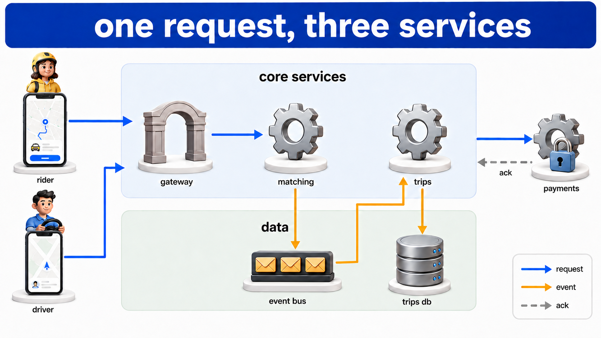</a>

*Glossy: a ride-sharing backend, blue request arrows into the gateway and matching, amber events through the bus to trips and its database, a padlock on payments.*

```
Style: premium system-design infographic. Clean white or very light gray background. Glossy semi-3D icons with soft drop shadows, one icon per component, sitting on subtle rounded platforms. Flows drawn as vivid color-coded directional arrows, each color meaning exactly one kind of traffic, with a small legend inside the image. Solid lines are actual transfers; dashed lines are reserved for control, acknowledgement, retry, and optional paths. Related components grouped inside rounded soft-tinted panels with a short title on the panel. A bold title banner across the top. Official product logos only on components that ARE that product; every other component gets a clean generic glyph. Small cartoon figures or vehicles for external actors (users, clients). Clean sans-serif labels under every icon, short and lowercase-friendly. Depth is relative: only the primary component icons carry dimensionality, containers stay flat and low contrast, and arrows are flat vector overlays above everything. Shadows are soft and directly beneath their object, never dramatic or angled. No glassmorphism, no neon glow, no photorealism, no heavy bevelling, no gradients except subtle material shading inside an icon. Generous spacing, no clutter, no watermark.

Scene: landscape 16:9. Reading left to right. Far left, outside any panel, two phones with a rider persona above one and a driver persona above the other. Centre, a wide tinted panel titled "core services" holding, left to right, a gateway arch, a gear block labelled "matching", and a gear block labelled "trips". Beneath the panel a second tinted panel titled "data" holding one database cylinder and a row of envelopes on a bar labelled "event bus". Far right, outside the panels, a gear block labelled "payments" with a padlock at its base. Title banner reads "one request, three services".

Cast: rider phone, driver phone, gateway arch, matching service, trips service, event bus, trips database, payments service, padlock.

Flows: blue solid arrows from both phones into the gateway and from the gateway to matching. Amber solid arrows from matching to the event bus, from the event bus to trips, and from trips down into the database. A blue solid arrow from trips to payments. A dashed gray arrow back from payments to trips labelled "ack". Legend in the lower right corner: blue "request", amber "event", gray dashed "ack".

Text in the image: "one request, three services", "core services", "data", "rider", "driver", "gateway", "matching", "trips", "event bus", "trips db", "payments", "ack", "request", "event".

Exclusions: no brand logos, no components beyond those listed, no placeholder gibberish text, no watermark, no duplicated components, no orphan arrows, no arrow terminating in whitespace, no color used without a legend entry, no decorative circuitry or filigree, no paragraphs of text, no crossing arrows where routing could avoid it, no untitled containers, no icon without a label, no perspective distortion applied to arrows.
```

Faithfulness note: exactly two phones on the left, two titled panels in the centre, and one padlock on the payments service. Blue arrows only enter the gateway and matching and payments; amber arrows only touch the bus, trips and the database.

### Prompt 2 (Subject): Vendor, a feature-store pipeline

Navigation: ⬅️ [Previous](#prompt-1-subject-vivid-circuit-a-ride-sharing-backend) | 📋 [TOC](#table-of-contents) | [Next](#prompt-3-subject-cloud-vendor-clean-tinted-the-same-pipeline-with-unbranded-services) ➡️

[traced] 🖼️ rendered 2026-09-03: `diagrams/02-cloud-vendor-clean-feature-store-pipeline.png`
Save as: `diagrams/02-cloud-vendor-clean-feature-store-pipeline.png`

<a href="diagrams/02-cloud-vendor-clean-feature-store-pipeline.png">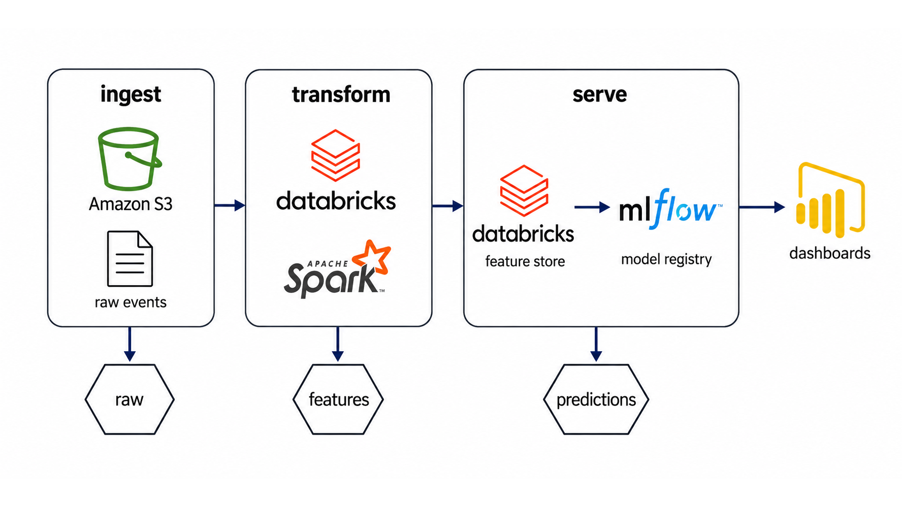</a>

*Vendor: a feature-store pipeline in three titled containers, official logos only, one arrow colour, a hexagonal data badge beneath each phase.*

```
Style: clean corporate cloud-architecture diagram in the style of official vendor documentation. White or very light background. Official product logos and service icons at consistent size. Large rounded-outline containers grouping phases, each container titled in bold at its top. Thin directional arrows in a single accent color connecting stages. Small labeled artifact icons (hexagonal data badges, document icons, key icons) beneath the flow for inputs and outputs. Flat, precise, generous whitespace, clean sans-serif labels, no gradients, no decoration that carries no meaning.

Scene: landscape 16:9. Reading left to right. Three rounded-outline containers side by side titled "ingest", "transform", "serve". Inside "ingest": an Amazon S3 logo above a small document icon labelled "raw events". Inside "transform": a Databricks logo above an Apache Spark logo. Inside "serve": a Databricks logo labelled "feature store" and, to its right, an MLflow logo labelled "model registry". Far right outside the containers, a Power BI logo labelled "dashboards". Beneath the whole flow a thin row of three hexagonal data badges labelled "raw", "features", "predictions", each sitting under the container that produces it.

Cast: Amazon S3, Databricks (twice), Apache Spark, MLflow, Power BI, three data badges, one document icon.

Flows: thin dark-blue arrows left to right: S3 to Databricks, Databricks to the feature store, feature store to the model registry, model registry to Power BI. One thin dark-blue arrow from each container down to its data badge.

Text in the image: "ingest", "transform", "serve", "raw events", "feature store", "model registry", "dashboards", "raw", "features", "predictions".

Exclusions: no logos beyond Amazon S3, Databricks, Apache Spark, MLflow and Power BI, no invented products, no colour other than the single dark-blue arrow accent and the logos' own colours, no placeholder gibberish text, no watermark, no duplicated components, no orphan arrows, no arrow terminating in whitespace, no decorative circuitry or filigree, no paragraphs of text, no crossing arrows, no untitled containers, no icon without a label.
```

Faithfulness note: three titled containers, five distinct brand logos and no others, one arrow colour. Every hexagonal badge sits beneath a container and not between two.

### Prompt 3 (Subject): Vendor tinted, the same pipeline with unbranded services

Navigation: ⬅️ [Previous](#prompt-2-subject-cloud-vendor-clean-a-feature-store-pipeline) | 📋 [TOC](#table-of-contents) | [Next](#prompt-4-subject-outline-cartoon-batch-against-streaming) ➡️

[traced] 🖼️ rendered 2026-09-03: `diagrams/03-cloud-vendor-clean-tinted-unbranded-services.png`
Save as: `diagrams/03-cloud-vendor-clean-tinted-unbranded-services.png`

<a href="diagrams/03-cloud-vendor-clean-tinted-unbranded-services.png">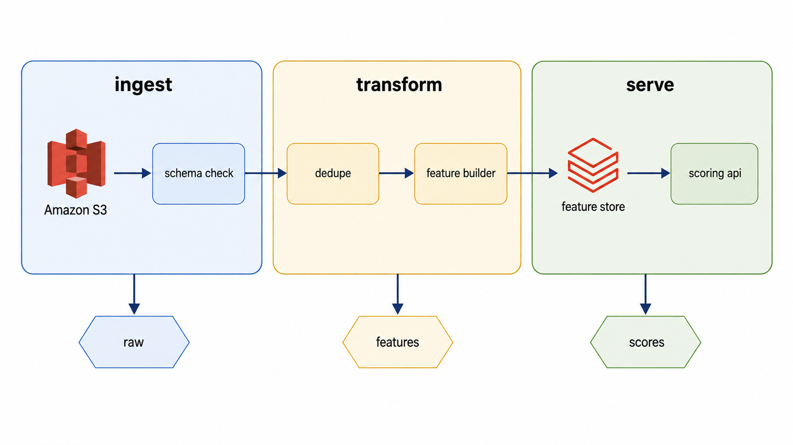</a>

*Vendor, tinted variant: the same three phases with pastel container fills, two logos, and four unbranded services filled in their own phase's tint.*

```
Style: clean corporate cloud-architecture diagram in the style of official vendor documentation. White or very light background. Official product logos and service icons at consistent size. Large rounded-outline containers grouping phases, each container titled in bold at its top. Thin directional arrows in a single accent color connecting stages. Small labeled artifact icons (hexagonal data badges, document icons, key icons) beneath the flow for inputs and outputs. Flat, precise, generous whitespace, clean sans-serif labels, no gradients, no decoration that carries no meaning. Tinted variant: each container carries a soft pastel fill (one hue per container, from a family of pale blue, pale amber, pale green), and every unbranded component is a rounded rectangle filled in a lighter tint of its container's hue with a thin outline, so unbranded services read as belonging to their phase rather than as gray boxes.

Scene: landscape 16:9. Reading left to right. Three tinted containers side by side: "ingest" in pale blue, "transform" in pale amber, "serve" in pale green. Inside "ingest": an Amazon S3 logo and, beside it, an unbranded rounded rectangle labelled "schema check". Inside "transform": two unbranded rounded rectangles labelled "dedupe" and "feature builder". Inside "serve": a Databricks logo labelled "feature store" and an unbranded rounded rectangle labelled "scoring api". Beneath the whole flow a thin row of three hexagonal data badges labelled "raw", "features", "scores".

Cast: Amazon S3, Databricks, four unbranded services, three data badges.

Flows: thin dark-blue arrows left to right through every component in order: S3, schema check, dedupe, feature builder, feature store, scoring api. One thin dark-blue arrow from each container down to its data badge.

Text in the image: "ingest", "transform", "serve", "schema check", "dedupe", "feature builder", "feature store", "scoring api", "raw", "features", "scores".

Exclusions: no logos beyond Amazon S3 and Databricks, no invented products, no colour beyond the three container tints, the single dark-blue arrow accent and the logos' own colours, no placeholder gibberish text, no watermark, no duplicated components, no orphan arrows, no arrow terminating in whitespace, no decorative circuitry or filigree, no paragraphs of text, no crossing arrows, no untitled containers, no icon without a label.
```

Faithfulness note: three containers with three visibly different pastel fills, exactly two brand logos, four unbranded services each filled in a lighter tint of its own container's hue and none in gray.

### Prompt 4 (Subject): Cartoon, batch against streaming

Navigation: ⬅️ [Previous](#prompt-3-subject-cloud-vendor-clean-tinted-the-same-pipeline-with-unbranded-services) | 📋 [TOC](#table-of-contents) | [Next](#prompt-5-subject-layered-cutaway-one-denoising-step) ➡️

[traced] 🖼️ rendered 2026-09-03: `diagrams/04-outline-cartoon-batch-against-streaming.png`
Save as: `diagrams/04-outline-cartoon-batch-against-streaming.png`

<a href="diagrams/04-outline-cartoon-batch-against-streaming.png">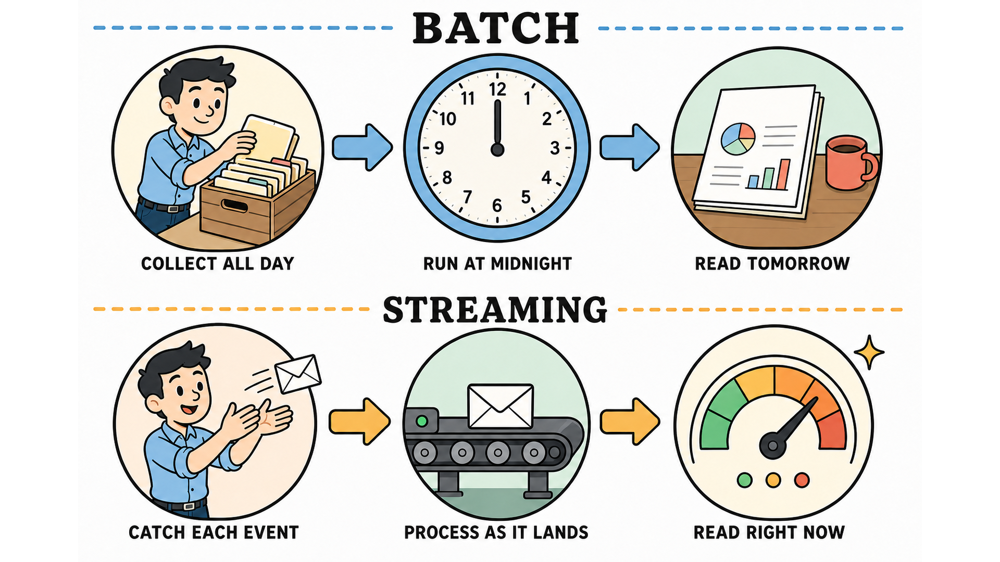</a>

*Cartoon: batch against streaming as two bands of three vignettes, the same operator in both, blue arrows above and amber below, nothing crossing between the bands.*

```
Style: playful flat-outline educational infographic. Thick dark rounded outlines, soft pastel fills, white background. Big friendly section titles in bold serif capitals set into dashed horizontal rules. Each stage drawn as a circular vignette with a cartoon scene inside and a short caption in small capitals beneath it. Chunky arrows between vignettes. A cartoon character actively doing the work in at least one vignette. Small sparkle accents. For a comparison: two horizontal bands, one per side, same glyph language in both so differences pop. Warm, clean, generous spacing.

Scene: landscape 16:9. Two horizontal bands. Upper band titled "BATCH" in a dashed rule, lower band titled "STREAMING" in a dashed rule. Each band has three circular vignettes left to right joined by chunky arrows. Upper band: a vignette of a cartoon character stacking paper files into a crate captioned "collect all day", a vignette of a wall clock pointing at midnight captioned "run at midnight", a vignette of a report on a desk captioned "read tomorrow". Lower band: a vignette of the same character catching single envelopes as they fly past captioned "catch each event", a vignette of a small conveyor belt captioned "process as it lands", a vignette of a live gauge captioned "read right now". The character is the same person in both bands. A small sparkle beside the live gauge.

Cast: the operator persona (same in both bands), paper files, crate, wall clock, report, flying envelopes, conveyor belt, gauge.

Flows: chunky pastel-blue arrows between the vignettes in the upper band, chunky pastel-amber arrows in the lower band. No arrows between bands.

Text in the image: "BATCH", "STREAMING", "COLLECT ALL DAY", "RUN AT MIDNIGHT", "READ TOMORROW", "CATCH EACH EVENT", "PROCESS AS IT LANDS", "READ RIGHT NOW".

Exclusions: no brand logos, no UI chrome, no pills or cards, no placeholder gibberish text, no watermark, no duplicated components, no orphan arrows, no arrow terminating in whitespace, no decorative circuitry or filigree, no paragraphs of text, no crossing arrows, no icon without a caption.
```

Faithfulness note: exactly six circular vignettes, three per band, the same character drawn in the first vignette of each band, and no arrow crossing from one band to the other.

### Prompt 5 (Subject): Cutaway, one denoising step

Navigation: ⬅️ [Previous](#prompt-4-subject-outline-cartoon-batch-against-streaming) | 📋 [TOC](#table-of-contents) | [Next](#prompt-6-subject-paper-minimal-a-product-of-two-experts) ➡️

[traced] 🖼️ rendered 2026-09-03: `diagrams/05-layered-cutaway-one-denoising-step.png`
Save as: `diagrams/05-layered-cutaway-one-denoising-step.png`

<a href="diagrams/05-layered-cutaway-one-denoising-step.png">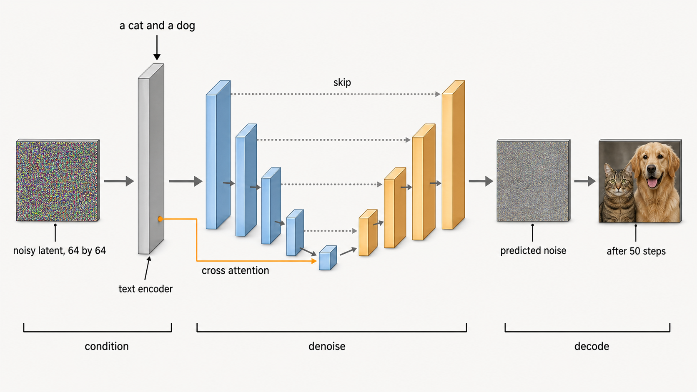</a>

*Cutaway: one denoising step, the noisy latent entering a U of shrinking then growing volumes, blue down and amber up, skip lines across, text conditioning in through cross attention, the sample images at both edges.*

```
Style: technical cutaway diagram, light background. The subject drawn as labeled 3D layered volumes or stacked stages left to right, with the actual data visibly transforming between stages. Real sample artifacts at the edges: an example input drawn at the left, the concrete output (bars, a table row, a labeled result) at the right. Horizontal labeled brackets beneath the image grouping stages into named phases. Thin leader lines from labels to parts. Restrained color: neutral grays and one warm plus one cool accent. Precise, textbook-quality, no cartoon elements.

Scene: landscape 16:9. Reading left to right. Far left, a small noisy square image of static labelled "noisy latent, 64 by 64". Then a tall thin gray slab labelled "text encoder" with a short line of text entering it from above reading "a cat and a dog". Then a U-shaped arrangement of 3D volumes shrinking toward the centre and growing again, the left arm in cool blue, the right arm in warm amber, with thin dotted lines across the U joining matching depths. Then a small square image, slightly less noisy, labelled "predicted noise". Far right, a clean square image of a cat beside a dog labelled "after 50 steps". Beneath, three brackets: "condition" under the encoder, "denoise" under the U, "decode" under the final image.

Cast: noisy latent sample, text encoder slab, four volumes on each arm of the U, predicted-noise sample, final image sample.

Flows: gray solid arrows carrying the latent left to right through the U. One amber leader line from the text encoder into the centre of the U labelled "cross attention". Dotted gray lines across the U labelled once "skip".

Text in the image: "a cat and a dog", "noisy latent, 64 by 64", "text encoder", "cross attention", "skip", "predicted noise", "after 50 steps", "condition", "denoise", "decode".

Exclusions: no cartoon elements, no brand logos, no icons, no pills or cards, no placeholder gibberish text, no watermark, no duplicated components, no orphan arrows, no arrow terminating in whitespace, no decorative circuitry, no paragraphs of text, no colour beyond gray, one blue and one amber.
```

Faithfulness note: the volumes shrink toward the middle of the U and grow again, the left arm is blue and the right arm amber, three brackets beneath, and the leftmost sample is visibly noisier than the rightmost.

### Prompt 6 (Subject): Paper, a product of two experts

Navigation: ⬅️ [Previous](#prompt-5-subject-layered-cutaway-one-denoising-step) | 📋 [TOC](#table-of-contents) | [Next](#prompt-7-subject-layered-stack-a-live-streaming-platform) ➡️

[traced] 🖼️ rendered 2026-09-03: `diagrams/06-paper-minimal-product-of-two-experts.png`
Save as: `diagrams/06-paper-minimal-product-of-two-experts.png`

<a href="diagrams/06-paper-minimal-product-of-two-experts.png">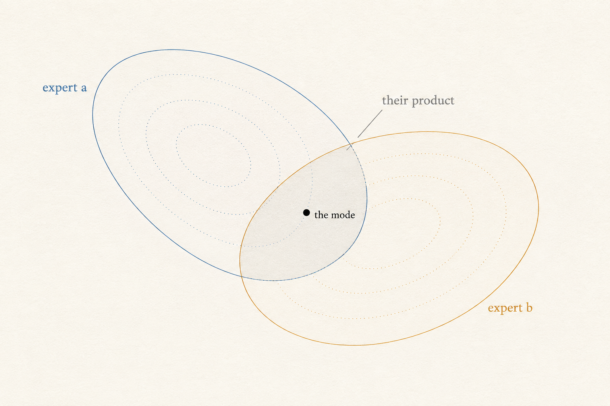</a>

*Paper: two experts as a blue and an amber ellipse on paper, their overlap shaded as the product, one black dot at its mode.*

```
Style: warm off-white paper background. One subject per image, drawn as clean geometry in fine ink-like lines. A restrained palette of exactly two accent colors carrying meaning, never decoration. All labels in a clean serif type, sparse, lowercase. No pills, no cards, no flowchart boxes, no UI chrome. Arrows only where the arrows are the subject.

Scene: landscape 3:2. Two overlapping ellipses drawn in fine ink, tilted against each other, one outlined in blue and one in amber, on a bare paper ground with no axes. Their overlap region is shaded very lightly in a neutral gray. A small filled black dot at the centre of the overlap. Faint dotted contour rings inside each ellipse suggesting density falling off from its own centre.

Cast: the blue ellipse, the amber ellipse, the shaded overlap, the black dot.

Flows: none.

Text in the image: "expert a" in blue beside the blue ellipse, "expert b" in amber beside the amber ellipse, "their product" in gray beside the overlap, "the mode" beside the black dot.

Exclusions: no axes, no grid, no boxes, no arrows, no icons, no UI chrome, no colour beyond blue, amber and gray, no placeholder gibberish text, no watermark, no paragraphs of text.
```

Faithfulness note: exactly two ellipses, one blue and one amber, their overlap shaded and the single black dot inside that overlap and nowhere else.

### Prompt 7 (Subject): Stack, a live-streaming platform

Navigation: ⬅️ [Previous](#prompt-6-subject-paper-minimal-a-product-of-two-experts) | 📋 [TOC](#table-of-contents) | [Next](#prompt-8-subject-geo-overlay-three-data-centres-and-their-latency) ➡️

[traced] 🖼️ rendered 2026-09-03: `diagrams/07-layered-stack-live-streaming-platform.png`
Save as: `diagrams/07-layered-stack-live-streaming-platform.png`

<a href="diagrams/07-layered-stack-live-streaming-platform.png">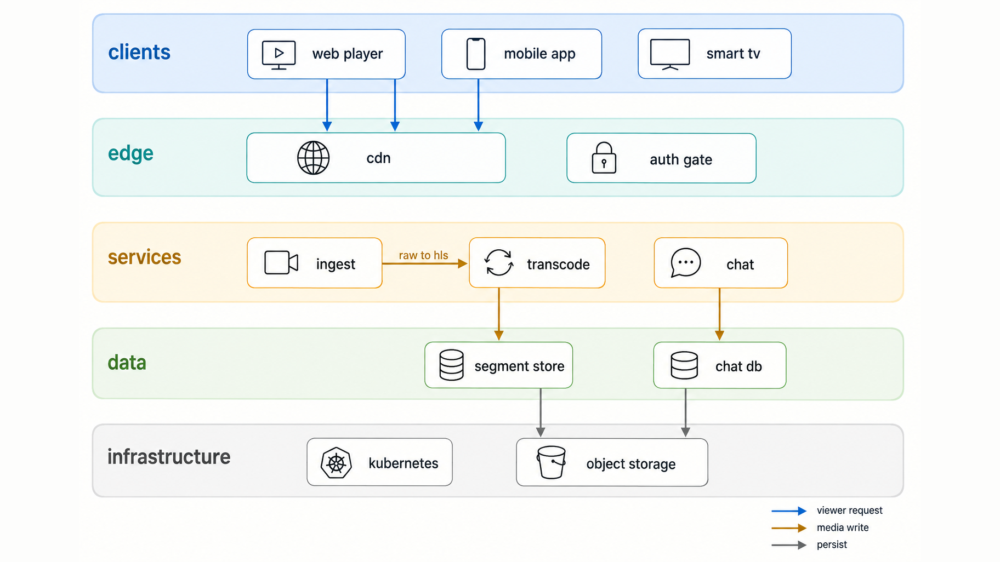</a>

*Stack : a live-streaming platform as five tinted bands, clients over edge over services over data over infrastructure, arrows crossing bands downward, one labelled sideways hop from ingest to transcode.*

```
Style: layered architecture stack, light background. The system drawn as horizontal bands stacked top to bottom, each band a full-width rounded rectangle in its own soft pastel tint with its name in bold at the left edge. Components sit inside their band as flat rounded tiles with a simple line icon and a short label, evenly spaced. Vertical arrows cross band boundaries where one layer calls the next; nothing flows sideways within a band unless labelled. A thin legend in a lower corner naming the arrow colours. Flat, calm, precise, no drop shadows, no 3D, no gradients, clean sans-serif labels.

Scene: landscape 16:9. Reading top to bottom, five full-width bands in order: "clients" in pale blue holding three tiles labelled "web player", "mobile app", "smart tv"; "edge" in pale teal holding two tiles labelled "cdn" and "auth gate" with a padlock icon; "services" in pale amber holding three tiles labelled "ingest", "transcode", "chat"; "data" in pale green holding two tiles labelled "segment store" and "chat db"; "infrastructure" in pale gray holding two tiles labelled "kubernetes" and "object storage". The bands are stacked with a visible gap between them, larger than the gap between tiles.

Cast: ten tiles across five bands, one padlock.

Flows: blue vertical arrows from the three client tiles down into "cdn". One amber vertical arrow from "ingest" down to "transcode" is drawn sideways within the services band and labelled "raw to hls". Amber vertical arrows from "transcode" down to "segment store" and from "chat" down to "chat db". Gray vertical arrows from the data band down into "object storage". Legend lower right: blue "viewer request", amber "media write", gray "persist".

Text in the image: "clients", "edge", "services", "data", "infrastructure", "web player", "mobile app", "smart tv", "cdn", "auth gate", "ingest", "transcode", "chat", "segment store", "chat db", "kubernetes", "object storage", "raw to hls", "viewer request", "media write", "persist".

Exclusions: no brand logos, no 3D, no drop shadows, no components beyond those listed, no placeholder gibberish text, no watermark, no duplicated components, no orphan arrows, no arrow terminating in whitespace, no colour used without a legend entry, no decorative circuitry, no paragraphs of text, no crossing arrows, no untitled band, no tile without a label.
```

Faithfulness note: five full-width bands in the stated order with five different tints, ten tiles in total, the only sideways arrow is the one labelled "raw to hls", and every other arrow crosses a band boundary downward.

### Prompt 8 (Subject): Map, three data centres and their latency

Navigation: ⬅️ [Previous](#prompt-7-subject-layered-stack-a-live-streaming-platform) | 📋 [TOC](#table-of-contents) | [Next](#process-lane) ➡️

[traced] 🖼️ rendered 2026-09-03: `diagrams/08-geo-overlay-three-data-centres-latency.png`
Save as: `diagrams/08-geo-overlay-three-data-centres-latency.png`

<a href="diagrams/08-geo-overlay-three-data-centres-latency.png">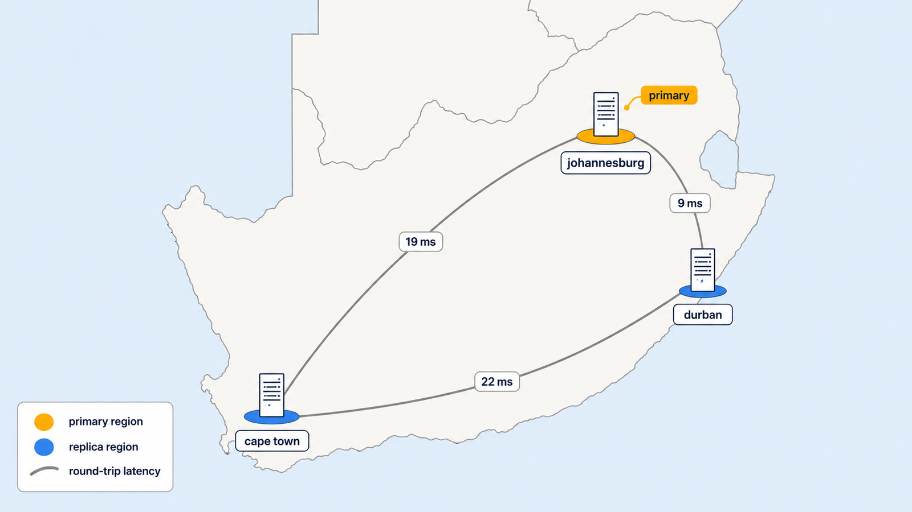</a>

*Map : three data centres pinned on a flat map of South Africa, Johannesburg amber as primary, Durban and Cape Town blue as replicas, three arcs each carrying a round-trip latency chip.*

```
Style: geographic overlay diagram. A light, desaturated base map with country outlines in thin gray and no place labels of its own, drawn as a flat vector map. Places of interest marked with a pin or a small flat platform at their true position, each with a short label. Connections drawn as smooth curved arcs between places, each arc carrying one small label chip at its midpoint with a number and its unit. Regions may be shaded in a single soft tint to carry one value. One accent colour for arcs, a second for the highlighted place. Small legend in a corner. Flat, clean, sans-serif, no 3D, no photorealism, no satellite texture.

Scene: landscape 16:9. A flat vector map of South Africa filling the frame, thin gray outline, pale off-white land, very pale blue sea. Three flat blue platforms at the true positions of Johannesburg (inland, north-east), Durban (east coast), and Cape Town (south-west tip), each with a small server-rack line icon and its city name beneath. Johannesburg's platform is amber instead of blue and carries a small chip reading "primary". Three curved gray arcs join the three cities pairwise, each with a white label chip at its midpoint: Johannesburg to Durban "9 ms", Johannesburg to Cape Town "19 ms", Durban to Cape Town "22 ms". Legend lower left: amber "primary region", blue "replica region", gray arc "round-trip latency".

Cast: the base map, three server platforms, three latency arcs, one primary chip.

Flows: the three arcs, undirected, gray.

Text in the image: "johannesburg", "durban", "cape town", "primary", "9 ms", "19 ms", "22 ms", "primary region", "replica region", "round-trip latency".

Exclusions: no place names other than the three cities, no roads, no rivers, no satellite imagery, no 3D, no brand logos, no placeholder gibberish text, no watermark, no arcs beyond the three listed, no colour used without a legend entry, no paragraphs of text.
```

Faithfulness note: Johannesburg sits inland in the north-east, Durban on the east coast, Cape Town at the south-west tip, with Johannesburg the only amber platform. Exactly three arcs, each with one latency chip, and the 22 ms chip on the Durban to Cape Town arc.

## Process lane

Navigation: ⬅️ [Previous](#subject-lane) | 📋 [TOC](#table-of-contents) | [Next](#prompt-9-process-metro-journey-a-pull-request-to-production) ➡️

Not regenerated from any plan tree. This gallery has no process history.

### Prompt 9 (Process): Metro, a pull request to production

Navigation: ⬅️ [Previous](#prompt-8-subject-geo-overlay-three-data-centres-and-their-latency) | 📋 [TOC](#table-of-contents) | [Next](#prompt-10-process-glossy-dashboard-a-nightly-load-with-one-failed-stage) ➡️

[traced] 🖼️ rendered 2026-09-03: `diagrams/09-metro-journey-pull-request-to-production.png`
Save as: `diagrams/09-metro-journey-pull-request-to-production.png`

<a href="diagrams/09-metro-journey-pull-request-to-production.png">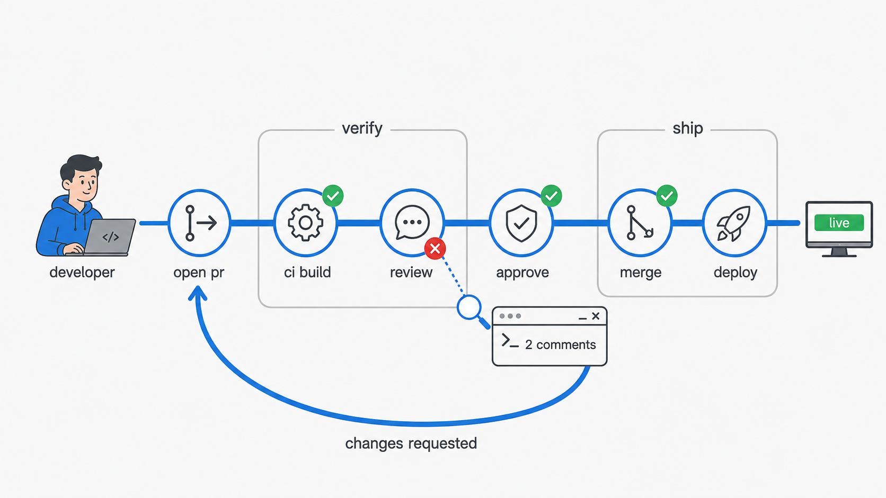</a>

*Metro: a pull request travelling one route from open pr to deploy, verify and ship panels, green passes, a red cross on review with its zoomed terminal, and the changes-requested loop back to the start.*

```
Style: modern process-journey infographic. Light background. One thick continuous route line flowing left to right like a metro line, with circular icon nodes sitting on the line at each stage. Segments of the route enclosed in thin rounded panels titled with the phase name. Loops drawn as the route line physically looping back. Small status chips near nodes: green check circles for passes, a red cross with a magnifier zoom-callout on the failure being inspected. A cartoon persona at the start of the route, named by role. Small monitor or terminal illustrations where results appear. Clean sans-serif labels, calm two-accent palette plus green/red status colors only.

Scene: landscape 16:9. A developer persona labelled "developer" at the far left. One thick blue route line left to right through six circular nodes: "open pr", "ci build", "review", "approve", "merge", "deploy". Two thin rounded panels enclose route segments: "verify" around ci build and review, "ship" around merge and deploy. The route loops physically back from "review" to "open pr" as a lower arc labelled "changes requested". A green check chip beside "ci build", "approve" and "merge". A red cross chip beside "review" with a magnifier zoom-callout showing a small terminal reading "2 comments". A small monitor beside "deploy" showing a green bar labelled "live".

Cast: developer persona, six route nodes, two phase panels, one loop, three green chips, one red chip with callout, one monitor.

Flows: the single blue route line, the one loop back in the same blue.

Text in the image: "developer", "open pr", "ci build", "review", "approve", "merge", "deploy", "verify", "ship", "changes requested", "2 comments", "live".

Exclusions: no brand logos, no second route line, no nodes beyond the six listed, no placeholder gibberish text, no watermark, no colour beyond blue, gray, green and red, no paragraphs of text, no untitled panels.
```

Faithfulness note: exactly six nodes on one continuous line, one loop that leaves "review" and rejoins before "open pr" and nowhere else, one red chip and it is on "review".

### Prompt 10 (Process): Dashboard, a nightly load with one failed stage

Navigation: ⬅️ [Previous](#prompt-9-process-metro-journey-a-pull-request-to-production) | 📋 [TOC](#table-of-contents) | [Next](#prompt-11-process-swimlane-sequence-one-ride-request) ➡️

[traced] 🖼️ rendered 2026-09-03: `diagrams/10-glossy-dashboard-nightly-load-one-failed-stage.png`
Save as: `diagrams/10-glossy-dashboard-nightly-load-one-failed-stage.png`

<a href="diagrams/10-glossy-dashboard-nightly-load-one-failed-stage.png">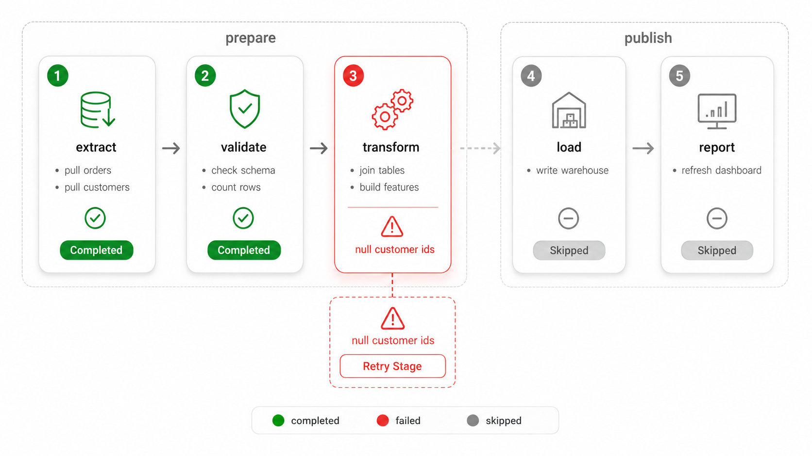</a>

*Dashboard: a nightly load as five numbered stage cards in prepare and publish containers, extract and validate completed, transform failed on null customer ids with its retry callout, load and report skipped.*

```
Style: glossy, minimalistic, modern UI/UX-style dashboard panel. Clean white or very light gray background. Rounded rectangle stage cards with soft drop shadows in a horizontal flow, connected by directional arrows, each card carrying a small numbered step badge and an icon. Inside each card, 2 to 4 tiny bullet lines naming what the stage actually does. Related cards grouped in a faintly outlined titled container when the process has phases. Success path: green accent, checkmark icons, "Completed" status pills. Failure path: red accent, an X or warning icon on the failed stage, the failure reason written on the card, a dashed retry/troubleshoot callout box with a "Retry Stage" button. Untouched downstream stages muted and grayed with a "Skipped" pill. A small legend row at the bottom (green: completed, red: failed, gray: skipped). Clean sans-serif labels, generous spacing, no clutter.

Scene: landscape 16:9. Five stage cards left to right with badges 1 to 5: "extract" with bullets "pull orders", "pull customers"; "validate" with bullets "check schema", "count rows"; "transform" with bullets "join tables", "build features"; "load" with bullets "write warehouse"; "report" with bullets "refresh dashboard". Cards 1 and 2 green with "Completed" pills. Card 3 red with a warning icon and the reason "null customer ids" written on it, and a dashed callout beneath it holding a "Retry Stage" button. Cards 4 and 5 grayed with "Skipped" pills. A faint container around cards 1 to 3 titled "prepare" and another around 4 and 5 titled "publish". Legend row at the bottom.

Cast: five stage cards, two phase containers, one retry callout.

Flows: gray arrows left to right between the cards, the arrow into card 4 drawn muted.

Text in the image: "1", "2", "3", "4", "5", "extract", "validate", "transform", "load", "report", "pull orders", "pull customers", "check schema", "count rows", "join tables", "build features", "write warehouse", "refresh dashboard", "Completed", "null customer ids", "Retry Stage", "Skipped", "prepare", "publish", "completed", "failed", "skipped".

Exclusions: no brand logos, no cards beyond the five listed, no placeholder gibberish text, no watermark, no colour beyond green, red, gray and one neutral accent, no paragraphs of text, no untitled containers.
```

Faithfulness note: exactly one red card and it is card 3, two green cards to its left, two gray cards to its right, and the retry callout attached to card 3 only.

### Prompt 11 (Process): Swimlane, one ride request

Navigation: ⬅️ [Previous](#prompt-10-process-glossy-dashboard-a-nightly-load-with-one-failed-stage) | 📋 [TOC](#table-of-contents) | [Next](#prompt-12-process-state-lifecycle-the-life-of-a-trip) ➡️

[traced] 🖼️ rendered 2026-09-03: `diagrams/11-swimlane-sequence-one-ride-request.png`
Save as: `diagrams/11-swimlane-sequence-one-ride-request.png`

<a href="diagrams/11-swimlane-sequence-one-ride-request.png">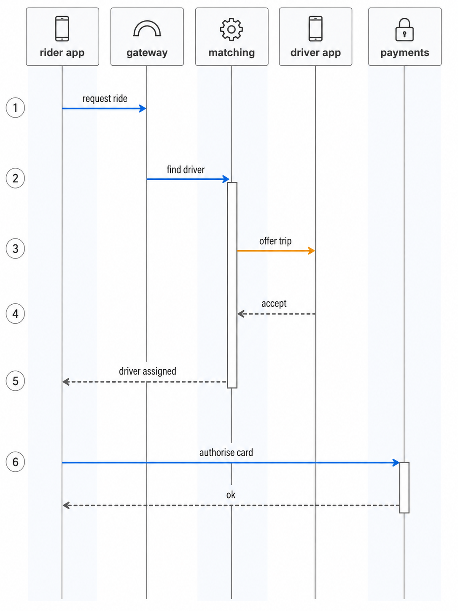</a>

*Swimlane : one ride request crossing five lanes, time running down with numbered badges, solid blue requests, an amber offer event, dashed gray replies, activation bars on matching and payments.*

```
Style: swimlane sequence diagram, light background. Each actor or service is a vertical lane: a small icon and a bold label in a header tile at the top, and a thin vertical lifeline running down the full height beneath it. Time runs top to bottom, marked by small numbered badges down the left margin. Messages are horizontal arrows from one lifeline to another, each with a short label above it; solid arrows for a call or an event, dashed arrows for a reply. A thin activation bar thickens a lifeline while that actor is busy. Lanes tinted very faintly and alternately so the eye can follow one down the page. Flat, precise, clean sans-serif, no 3D, no drop shadows.

Scene: portrait 3:4. Five lanes left to right: "rider app" with a phone icon, "gateway" with an arch icon, "matching" with a gear icon, "driver app" with a phone icon, "payments" with a padlock icon. Numbered badges 1 to 6 down the left margin. Messages in order: 1, a solid blue arrow from rider app to gateway "request ride"; 2, solid blue from gateway to matching "find driver"; 3, solid amber from matching to driver app "offer trip"; 4, dashed gray from driver app back to matching "accept"; 5, dashed gray from matching back to rider app across the gateway lane "driver assigned"; 6, solid blue from rider app to payments "authorise card", with a dashed gray reply "ok". Activation bars on matching between messages 2 and 5, and on payments during message 6.

Cast: five lane headers with icons, five lifelines, six numbered messages, two activation bars.

Flows: as listed, blue solid for a request, amber solid for an event, gray dashed for a reply.

Text in the image: "rider app", "gateway", "matching", "driver app", "payments", "1", "2", "3", "4", "5", "6", "request ride", "find driver", "offer trip", "accept", "driver assigned", "authorise card", "ok".

Exclusions: no brand logos, no lanes beyond the five listed, no messages beyond the seven arrows listed, no placeholder gibberish text, no watermark, no 3D, no drop shadows, no colour beyond blue, amber and gray, no paragraphs of text, no diagonal arrows.
```

Faithfulness note: five lanes in the stated order, badges 1 to 6 in a single column on the left, every arrow horizontal, the "accept" and "driver assigned" arrows dashed and pointing leftward.

### Prompt 12 (Process): States, the life of a trip

Navigation: ⬅️ [Previous](#prompt-11-process-swimlane-sequence-one-ride-request) | 📋 [TOC](#table-of-contents)

[traced] 🖼️ rendered 2026-09-03: `diagrams/12-state-lifecycle-life-of-a-trip.png`
Save as: `diagrams/12-state-lifecycle-life-of-a-trip.png`

<a href="diagrams/12-state-lifecycle-life-of-a-trip.png">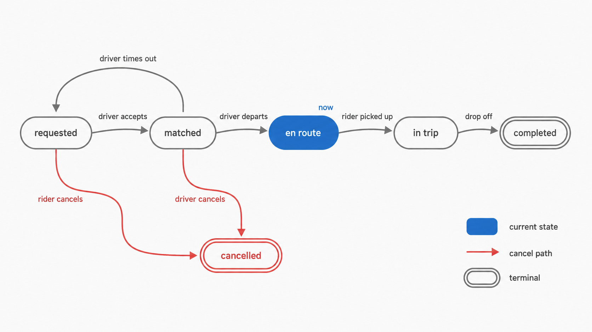</a>

*States : the life of a trip from requested to completed, en route highlighted as the current state, two red cancel paths into the terminal cancelled state, and the driver-timeout loop back to requested.*

```
Style: state lifecycle diagram, light background. Each state is a rounded pill-shaped node with a short label, laid out so the main path reads left to right. Transitions are curved arrows with a short label on each naming the event that causes them. One state is highlighted as current with a filled accent and a small "now" tag; the others are outlined only. Terminal states carry a double outline. Branches that leave the main path curve downward; a return to an earlier state loops back above. A small legend in a corner. Flat, calm, clean sans-serif, no 3D, no drop shadows, no icons inside states.

Scene: landscape 16:9. Main path left to right of five pill nodes: "requested", "matched", "en route", "in trip", "completed". "completed" has a double outline. A sixth node "cancelled" sits below the middle of the path, also double-outlined. "en route" is filled blue with a small tag "now"; every other node is outlined only. Transitions: "requested" to "matched" labelled "driver accepts"; "matched" to "en route" labelled "driver departs"; "en route" to "in trip" labelled "rider picked up"; "in trip" to "completed" labelled "drop off". Downward red curved arrows into "cancelled" from "requested" labelled "rider cancels" and from "matched" labelled "driver cancels". One gray loop above the path from "matched" back to "requested" labelled "driver times out". Legend lower right: blue "current state", red "cancel path", double outline "terminal".

Cast: six state nodes, seven transitions.

Flows: as listed, gray for the main path and the loop, red for the two cancel arrows.

Text in the image: "requested", "matched", "en route", "in trip", "completed", "cancelled", "now", "driver accepts", "driver departs", "rider picked up", "drop off", "rider cancels", "driver cancels", "driver times out", "current state", "cancel path", "terminal".

Exclusions: no brand logos, no icons inside the states, no states beyond the six listed, no placeholder gibberish text, no watermark, no 3D, no drop shadows, no colour beyond blue, red and gray, no paragraphs of text.
```

Faithfulness note: six nodes, exactly one filled in blue and it is "en route", two double-outlined nodes and they are "completed" and "cancelled", both red arrows end at "cancelled", and the loop rejoins "requested".
