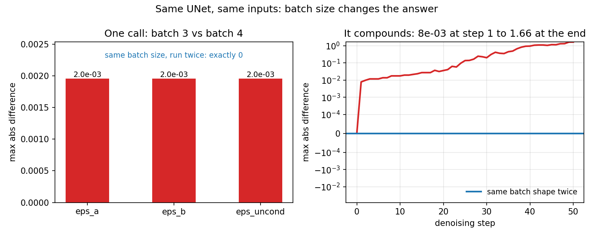

# Why does the dose-zero check never match plain PoE exactly?

A safety check in the correction pipeline runs the injection code at dose zero and expects an
exact match against plain product-of-experts, since dose zero should inject nothing. The check
kept failing. This folder is the diagnosis: the same UNet, fed the exact same latent and prompt,
returns a different answer depending on how many other prompts share the batch with it, and that
small difference compounds over fifty denoising steps into a visibly different image.

## What is in here

One two-panel figure, its JSON measurement record, the script that reproduces both, and this
note's source, `note.md`.

## Same UNet, same inputs: batch size changes the answer

**What it shows**

Left panel: for one denoising call on `a_cat__x__a_dog`, seed 9, fp16, comparing the UNet's
prediction for prompt A, prompt B, and the unconditional prompt when the same three prompts run
in a batch of 3 against when they run alongside a fourth prompt in a batch of 4. Bar height is
the largest absolute difference between the two batch sizes, for each of the three branches.
Right panel: the same comparison carried through all 50 denoising steps, y-axis on a symmetric
log scale, showing how a per-step difference of about 2e-3 grows into the final latent.

**How we got this image**

`measure.py` in this folder runs the real UNet on this repo's own composers and samplers
(`poe_repair.methods._sampling.run_cfg_poe` and `run_teacher_residual`) on an RTX 3090 in fp16,
records the numbers to `measurements.json`, and plots them with matplotlib.

**What it lets you say**

The unconditional branch, given byte-identical latent and prompt, returns a different
prediction (maximum absolute difference 1.953e-03) depending on whether it shares its batch
with three prompts or four. Running the same batch size twice gives a bit-identical result, so
the cause is the batch shape, not randomness. Over 50 sampling steps that per-step gap compounds
to a maximum absolute difference of 1.66 in the final latent, which is a visibly different
image, not a rounding detail.

**What it cannot say**

Everything here is one pair (`a_cat__x__a_dog`), one seed (9), one GPU (an RTX 3090), fp16. The
qualitative facts (batch size changes the answer, a fixed batch shape is deterministic, the
difference compounds) hold generally because they are properties of kernel selection in fp16
matrix multiplication, but the exact numbers (1.953e-03, 1.66) are specific to this hardware and
library version and are not universal constants.

**Where it came from and what judged it**

`report/instrument_smoke.md` cites these same numbers to explain why the interaction-term
canaries in `tests/test_interaction_term_canaries.py` hold the batch shape fixed at four
branches and vary only the injection dose `λ`, rather than testing dose-zero against plain PoE
directly. The tools plan
[`01-build-the-measuring-scripts.md`](../../../plans/03-does-the-correction-cause-composition/plans/tools/01-build-the-measuring-scripts.md)
in the scope `does-the-correction-cause-composition` records the same finding as the reason its
must-pass checks compare only same-batch-shape runs.
