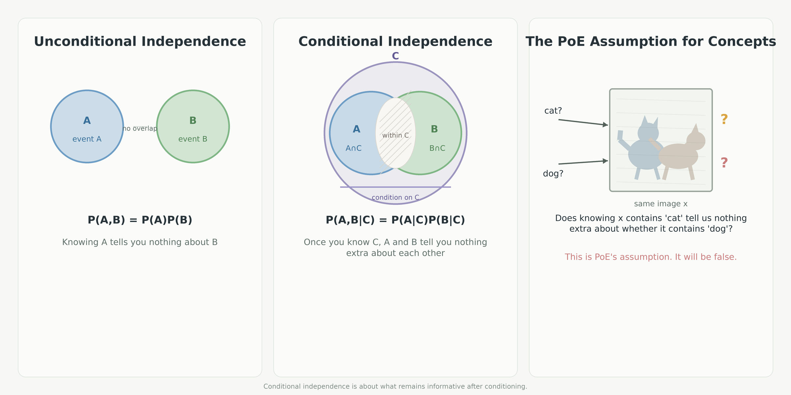

# Does CoInD train away the same term this project measures and re-injects?

CoInD (Gaudi, Sreekumar, Boddeti, ICLR 2025, arXiv 2503.01145) adds a training-time loss that
forces a diffusion model's own joint score to equal its own sum of marginal scores, which is the
conditional-independence property product-of-experts composition assumes at inference without
ever checking. This note is a full read of the 33-page paper, appendices included, to settle
whether CoInD's loss and this project's correction term are the same quantity approached from
opposite ends: CoInD trains it to zero, this project measures it and learns to add it back.

## What is in here

One explainer image drawn for this note, and the note itself (`coind-conditional-independence-loss.md`,
built to HTML by `build.sh` using the local `tufte.css`, which is styling, not content).

## Unconditional versus conditional independence, and where PoE's assumption sits

**What it shows**

Three panels, left to right. Unconditional independence: two non-overlapping circles, "knowing
A tells you nothing about B." Conditional independence: two circles overlapping inside a larger
region C, "once you know C, A and B tell you nothing extra about each other." Product-of-experts
for concepts: one image containing a cat and a dog, with two arrows asking "does knowing x
contains 'cat' tell us nothing extra about whether it contains 'dog'", captioned "this is PoE's
assumption. It will be false."

**How we got this image**

Drawn as a standalone explainer diagram, not read off any run or paper figure.

**What it lets you say**

Product-of-experts composition assumes the two concepts are conditionally independent given the
image, and names the assumption in the same terms the note's derivation uses later (the AND
rule's rest on $p(C\mid X) = \prod_i p(C_i \mid X)$).

**What it cannot say**

It is an illustration of the assumption, not a measurement of whether it holds; the measurement
is the paper's own colored-MNIST numbers described in the note (98.15% direct against 99.98%
composed under full support, worsening to 33.14% against 7.40% under partial support).

## The pieces

**The rearrangement that connects the two projects.** The note's closing section shows CoInD's
implemented penalty, $\|[\epsilon_\theta(c_i) + \epsilon_\theta(c_j) - \epsilon_\theta(c_\varnothing)] -
\epsilon_\theta(c_{i,j})\|^2$, rearranges to exactly $\|r_t\|^2$: CoInD's whole method is driving
this project's correction residual to zero during training, the opposite of retaining it and
asking what structure it has.

**A full methodology and results read**, including the training loop step by step, the
Fisher-divergence identity behind the loss, three training supports (uniform, non-uniform,
diagonal partial), results on Colored MNIST, Shapes3D, CelebA, and fine-tuned Stable Diffusion
v1.5.

**A quantitative and qualitative assessment with caveats carried forward rather than dropped**:
no error bars or seed counts on any headline number; the reported JSD values (up to 2.75) exceed
the standard 0.693-nat bound for Jensen-Shannon divergence with no stated normalization; the
CelebA table caption claims CoInD wins across the board while the AND-composition conformity
score for "smiling and male" actually ranks CoInD last (8.79 against LACE's 24.20); training
wall-clock and the $\lambda=100$ choice for CelebA are never disclosed.

**Where it came from and what judged it**

`plans/standing/literature/reading-register.md` (row for arXiv 2503.01145, CoInD) records this
note as the deep read behind the register's entry and cites it by path,
`artifacts/notes/coind-conditional-independence-loss/`, routing it to the scope
`does-the-correction-cause-composition` and to the manuscript's problem-setting, background, and
related-work sections.
