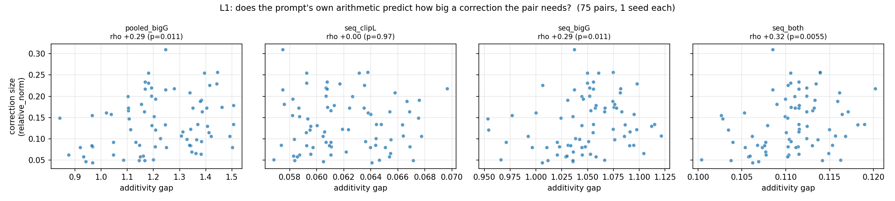
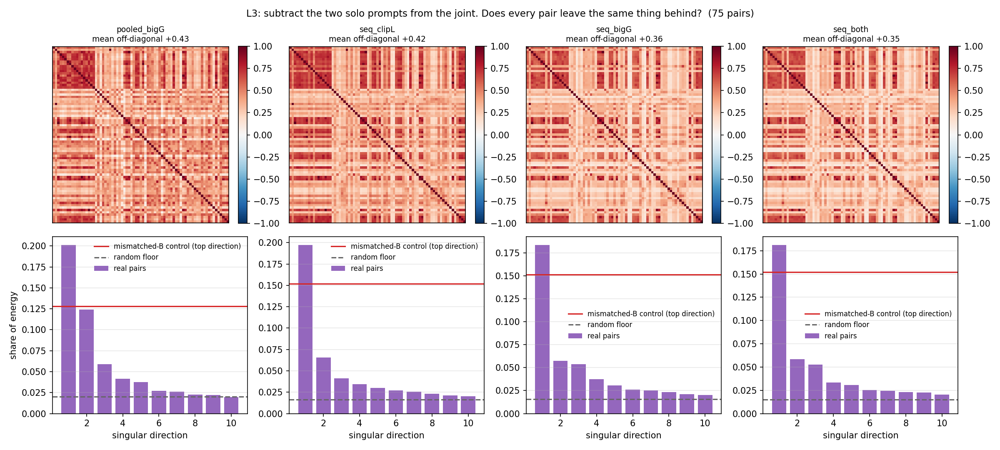
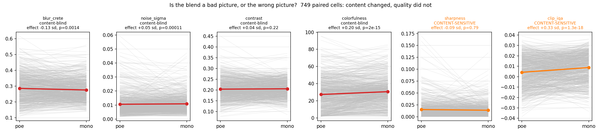
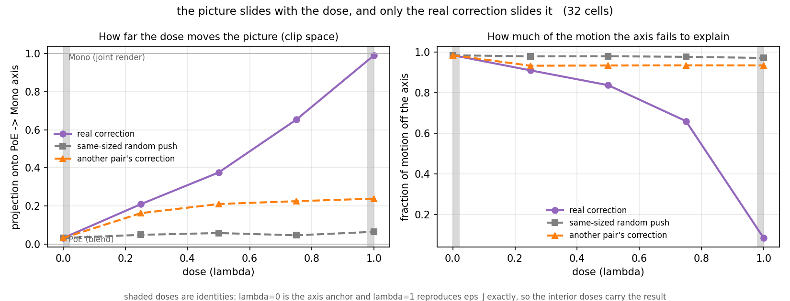
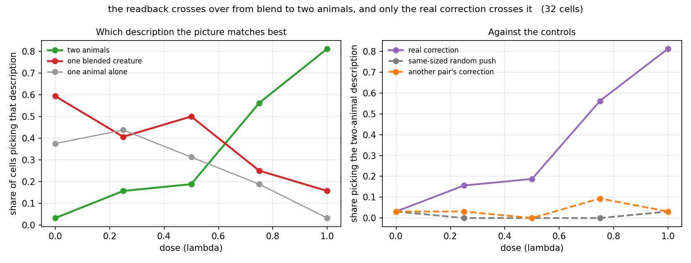

# Do three independent kinds of check agree the correction causes composition?

The dose sweep and the window sweep in this question folder's sibling analyses both read the same
detector on the same kind of cached run. These five checks were written to share none of that
machinery: two read the prompt's text embedding instead of the image, one reads image-quality
proxies instead of the compose detector, one reads position in CLIP image space instead of a box
count, and one reads captions instead of pixels. Two came back null and three came back positive,
and every pass or fail line was written down before its run, in the design file linked below.

Copies of the run outputs are kept here so the numbers are readable without reaching for
`/datasets`. The originals live in
`/datasets/mmolefe/poe_repair_min/outputs/interaction_term/cache_analyses/`.

Design: the [same-story-from-three-sides hypothesis plan](../../../../plans/03-does-the-correction-cause-composition/plans/hypothesis/06-the-same-story-from-three-sides.md)
Verdicts: the [same-story-from-three-sides review](../../../../plans/03-does-the-correction-cause-composition/review/06-the-same-story-from-three-sides.md)

## What is in here

Four figures and their four JSON sidecars. `language_probes.json` is shared by two of the
figures (L1 and L3); `quality_control_cache.json`, `manifold_slide_clip.json` and
`caption_readback.json` each back one figure of the same name.

| Question | Answer | Figure |
|---|---|---|
| Can the prompt's text predict which pairs are hard? | No | `language_probe_l1_additivity.png` |
| Do all pairs leave the same thing behind in text space? | No | `language_probe_l3_binding.png` |
| Is a blend the wrong picture rather than a bad picture? | Yes | `quality_control_cache.png` |
| Do pictures slide out of the blend region as the dose rises? | Yes | `manifold_slide_clip.png` |
| Do captions flip from "one blended creature" to "two animals"? | Yes | `caption_readback.png` |

## language_probe_l1_additivity.png



**What it shows**

Four scatter panels, one per way of reading the CLIP text embedding of "a X and a Y" against the
solo prompts "a X" and "a Y" (`pooled_bigG`, `seq_clipL`, `seq_bigG`, `seq_both`). Each point is one
of 75 pairs, one seed each. X is the additivity gap: how far the joint prompt's embedding sits from
the sum of the two solo embeddings, in that view. Y is the correction size the pair actually needed
(relative norm of r_t). Each panel's title carries its Spearman rho and p-value.

**How we got this image**

`python scripts/language_probes.py --probe l1`, read from the training cache, 75 pairs, ~1 minute.
The reading and the correlations are in `language_probes.json`.

**What it lets you say**

The pre-registered bar was |rho| >= 0.30 at p <= 0.05. Three of the four views miss it
(pooled_bigG +0.29, seq_clipL +0.00, seq_bigG +0.29); only `seq_both` clears it, narrowly, at
+0.32 (p = 0.0055). A predictor that only shows up when the two token sequences are concatenated
and not in either sequence alone, and not in the pooled embedding, is not a predictor: the
difficulty of a pair is not written in its prompt embedding in any view that was tested.

**What it cannot say**

This tests four fixed views of the isolated text embedding, not the state the model actually
computes from the two prompts jointly (cross-attention). A null here does not rule out that
difficulty is legible somewhere else in the model; it only rules out these four views.

**Where it came from and what judged it**

Design and verdict: the plan and review files linked above. Script: `scripts/language_probes.py`.

## language_probe_l3_binding.png



**What it shows**

Top row: four correlation heatmaps (one per embedding view), 75-by-75, of the residual left after
subtracting the two solo-prompt embeddings from the joint one, one row/column per pair. Bottom row:
for each view, the share of that residual's total energy carried by its top ten singular
directions, as a bar chart, with a random-floor line and a mismatched-control line.

**How we got this image**

Same script and cache as L1, same 75 pairs. `language_probes.json`'s `l3` block.

**What it lets you say**

Against an isotropic random floor (1.5% to 2.0% of the energy) the top shared direction looks
emphatic: 18% to 20% of the energy, a 10x to 12x margin. That margin survives a stricter control:
rebuilding the residual with the second solo prompt swapped in from a different pair (same "a X
and a Y" shape, same length, same anisotropy, only the actual binding destroyed) still reaches only
12.8% to 15.2%, so real pairs beat that control by 1.19x to 1.57x.

**What it cannot say**

The isotropic floor is the wrong comparison and the margin against it is mostly an artefact: every
prompt shares the shape "a X and a Y", and the CLIP-L sequence embeddings are nearly parallel
across all 75 pairs before any subtraction (mean pairwise cosine +0.999), which is most of where
the 10x to 12x looked to come from. Read against the matched control instead, the real margin is
1.19x to 1.57x, not 10x to 12x, and it does not establish what the shared direction is (the word
"and", the extra length, or the anisotropy every CLIP text embedding carries), only that something
beyond those three shared surface properties survives.

**Where it came from and what judged it**

Design and verdict: the plan and review files linked above. Script: `scripts/language_probes.py`.

## quality_control_cache.png



**What it shows**

Six panels, one per image-quality or content proxy (blur, noise, contrast, colourfulness,
sharpness, CLIP-IQA). Each panel is a paired-lines plot: 749 cells, one grey line per cell running
from its PoE value to its Mono (fully corrected) value, with the population mean drawn in colour.
Each panel's title carries the paired effect size in standard deviations and its p-value.

**How we got this image**

`python scripts/quality_control.py`, 749 paired cells, same seed, prompt and sampler on both sides
of each pair, the interaction term the only thing that differs, ~20 minutes. Numbers, the barred
proxies and the excluded proxies are all in `quality_control_cache.json`.

**What it lets you say**

The content compose rate moves from 13.9% to 48.9% across the pair (323 cells gained, 61 lost,
McNemar p = 3.5e-44) while every content-blind quality proxy stays inside a pre-registered
+/-0.20 sd bar: blur −0.13 sd, noise −0.05 sd, contrast +0.04 sd, colourfulness +0.20 sd (this last
one lands exactly on the line). The correction changes what the picture depicts far more than it
changes how good the picture looks, so "your correction just makes prettier pictures" is not a
live objection to the compose-rate gain.

**What it cannot say**

Colourfulness at +0.1994 against a 0.20 bar is a caveat, not a clean pass. Two proxies were barred
from the verdict on purpose and are shown in the plot only for transparency: Laplacian sharpness
rises with the number of edges, so two animals score higher than one animal for a reason that has
nothing to do with quality, and CLIP's own aesthetic preference rises for anything less
anatomically distorted, and a chimera is distorted by definition. CLIP-IQA does show a gap
(+0.33 sd), which is exactly why it does not get a vote in the verdict. A short 12-cell smoke test
of this same check showed gaps on blur and noise that vanished entirely at the full 749 cells, so
this verdict should never be read off a subsample.

**Where it came from and what judged it**

Design and verdict: the plan and review files linked above. Script: `scripts/quality_control.py`.

## manifold_slide_clip.png



**What it shows**

Two panels, 32 cells, 5 doses, 3 injected vectors (real correction, another pair's correction,
a same-sized random push). Left: for each cell, how far the picture sits along the axis running
from that cell's own PoE render (dose 0) to its own Mono render (dose 1) in CLIP image space,
against dose. Right: what share of the picture's total motion under dose falls off that axis
entirely, against dose.

**How we got this image**

`python scripts/manifold_slide.py`, 32 cells x 5 doses x 3 rows, ~3 minutes. Numbers, the fitted
axis and the endpoint checks are in `manifold_slide_clip.json`.

**What it lets you say**

Only the real correction moves the picture along the axis toward the joint render: at doses 0.25,
0.50, 0.75 it reaches 0.21, 0.38, 0.65 (mean 0.413) against a pre-registered bar of 0.30. Another
pair's correction reaches 44% of that travel (0.16, 0.21, 0.23) and a same-sized random push
reaches 5% (0.05, 0.06, 0.05).

**What it cannot say**

The endpoints are arithmetic, not evidence: at full dose the injection adds all of r_t back onto
eps_PoE, which reproduces eps_J by construction (measured endpoint drift 1.9 grey levels of 255),
so only the three interior doses carry the result. A position on this axis is not a compose score;
whole-image CLIP similarity was already ruled out elsewhere in this repository as a way to tell a
blend from a composition, so only the row-to-row comparison along this specific axis survives that
null. At the interior doses, 66% to 91% of the picture's actual motion falls off the axis, so the
axis says where the picture is heading, not what has happened to it. And the 44% for a mis-aimed
correction clears the pre-registered 50%-of-real bar only loosely, this is the weakest number
across the five checks.

**Where it came from and what judged it**

Design and verdict: the plan and review files linked above. Script: `scripts/manifold_slide.py`.

## caption_readback.png



**What it shows**

Two panels, the same 32 cells as `manifold_slide_clip.png`. Left: share of cells whose picture
best matches each of three caption templates ("a cat and a dog", "one creature, part cat part
dog", one animal alone), against dose. Right: the two-animal share for the real correction against
the same two controls as the manifold-slide figure.

**How we got this image**

`python scripts/caption_readback.py`, same 32 cells, several wordings per template built from the
prompt the cell was actually generated with, ~3 minutes. `caption_readback.json` carries the
templates and the per-dose shares.

**What it lets you say**

The two-animal caption overtakes the blend caption at dose 0.75 (56% at dose 1.0 against 25% for
the blend caption). Both controls stay flat: the random push gains −3 percentage points and
another pair's correction gains 6, against a pre-registered bar of 50% of the real correction's
gain. This is CLIP image-text similarity, the same embedding space whose whole-image image-to-image
read was ruled out for this exact discrimination in the manifold-slide check; anchoring to text
instead of to other images recovers a separation that image-to-image distance could not find.

**What it cannot say**

Only 32 cells, all cat x dog, and the caption bank is hand-written rather than model-generated, so
this is a readback against a fixed vocabulary, not an open-ended description task.

**Where it came from and what judged it**

Design and verdict: the plan and review files linked above. Script: `scripts/caption_readback.py`.

## Reproducing

```bash
PY=/home-mscluster/mmolefe/miniforge3/envs/co3/bin/python

$PY scripts/language_probes.py --probe l1 --probe l3   # 75 pairs from cache, ~1 min
$PY scripts/quality_control.py                          # 749 image pairs, ~20 min
$PY scripts/manifold_slide.py                           # 32 cells x 5 doses x 3 rows, ~3 min
$PY scripts/caption_readback.py                         # same cells, caption bank, ~3 min
```

Outputs land in `/datasets/.../cache_analyses/`; copy them here to refresh this folder.
