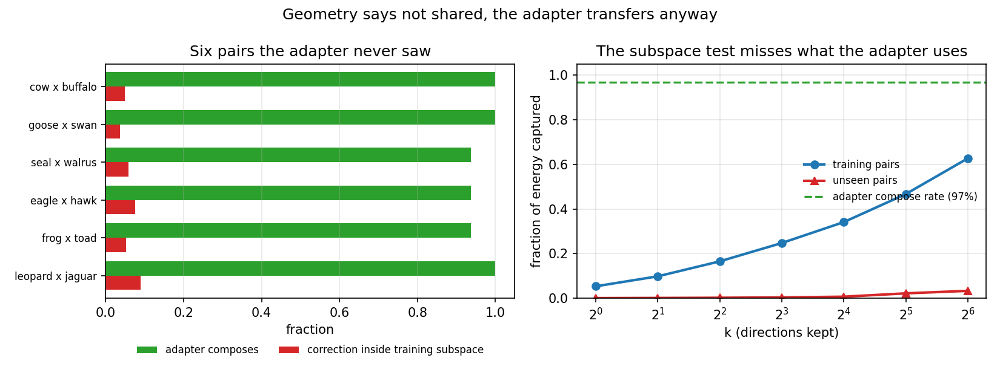

# Does the subspace test predict whether the LoRA transfers?

**Asked:** "show me how this exercise translates in a qualitative example whereby
the subspace test can help determine if the correction is shared? I would want
to see mono vs PoE vs shared correction across different examples, and perhaps
some visualization or manifold visualization of the subspace test. Is all this
possible or not helpful?"

**Date:** 2026-08-05 · Cache-only, no GPU, read-only.

## The big picture

The does-the-correction-cause-composition scope claims r_t is "small, shared across pairs, and
concentrated in a narrow noise band, which is why a rank-8 LoRA can learn it
once and fix pairs it never saw." The word doing the work is **shared**: if
every pair needs its own correction there is nothing to learn once.

The subspace test was meant to check sharedness cheaply, from the cache, before
spending compute. This asks whether it actually can.

Two independent readings of one question, on one split (11 training pairs,
6 unseen transfer pairs, run `1d3qy31e` / `lora_step_100000.pt`):

- **Geometry.** Fit a subspace to the training pairs' cached r_t, measure how
  much of the unseen pairs' r_t falls inside it.
- **Behaviour.** What the trained adapter actually did on those same pairs.

## Result: they disagree, and the geometry is wrong

| | |
|---|---|
| unseen pairs, adapter compose rate | **96.9%** |
| unseen pairs, r_t energy inside the training subspace (k=64) | **6.0%** |

Vanilla PoE composes **0%** on every one of these pairs (`fail_rate.md`, 8
seeds). So the adapter takes them from total failure to near-perfect, on pairs
it never trained on. That is transfer, measured behaviourally.

Per pair, at eval step 60000:

| pair | adapter composes | inside training subspace |
|---|---|---|
| a_leopard__x__a_jaguar | 100.0% | 9.0% |
| a_frog__x__a_toad | 93.8% | 5.2% |
| an_eagle__x__a_hawk | 93.8% | 7.5% |
| a_seal__x__a_walrus | 93.8% | 5.9% |
| a_goose__x__a_swan | 100.0% | 3.7% |
| a_cow__x__a_buffalo | 100.0% | 4.9% |

Rank correlation between the two columns: **-0.43**. Not merely uninformative,
mildly backwards.



## Why the geometry misses it

Cosine similarity between r_t vectors, seed-matched, at four steps:

| | train to train | train to unseen |
|---|---|---|
| step 5 | +0.017 | +0.001 |
| step 15 | -0.001 | +0.002 |
| step 25 | +0.003 | +0.004 |
| step 40 | +0.007 | +0.001 |

**Every value is essentially zero, including train-to-train.** Different pairs'
corrections are near-orthogonal. So is the *same pair* at step 5 versus step 40
(+0.004).

That is the explanation. r_t vectors share no common direction with each other,
so no subspace fitted on some of them can contain the others, and the test
returns a low number no matter what. It would have returned a low number even
if the adapter transferred perfectly, which is exactly what happened.

The subspace test asks "do these vectors point the same way?" The adapter is
not reusing a direction. It is a function of x_t and the prompt, applied inside
the UNet, and it computes a different r_t for each pair. What transfers is the
**rule**, not the vector.

## What was ruled out

A rank-8 least-squares map from x_t to r_t, fitted on the 11 training pairs,
explains 3.9% of variance on training pairs and -48% on unseen ones. That is a
negative for the linear proxy, not for the adapter: a LoRA acts inside the
UNet with prompt conditioning, and a linear map on raw latents cannot represent
that. It does confirm that no *cheap cache-only* stand-in tested here sees what
the adapter sees.

## What this means

**The claim "shared across pairs" survives, but not in the form the subspace
test assumed.** The behavioural evidence for sharedness is strong: one adapter,
11 pairs, 97% on six unseen ones. What is false is the vector-level reading, that
all pairs' corrections live in one low-dimensional subspace.

**Practical consequence.** Do not use the subspace test to predict transfer, and
do not report a low held-out projection as evidence against sharedness. It was
about to be reported exactly that way.

Two live options for the scope:

1. Reframe the smallness claim. The rank-8 result stands on its own (the
   adapter is rank 8 and works). Drop the subspace-overlap framing.
2. Find a cache-only measure that does predict transfer, if one is wanted. It
   would have to be conditioned on x_t and the prompt rather than pooling
   vectors. Whether that is worth building is a scoping question, not a
   measurement one.

## Real-life scenario

Without this check, the sequence goes: run the subspace test, read 6%, write
"the correction is not shared across pairs" into the paper, and either weaken
the central claim or spend weeks re-designing an adapter that already worked.
The 100k run had already answered the question in the opposite direction; the
two had simply never been put side by side.

## Limits

- One split, 11 training pairs. Thin.
- One trained adapter (`1d3qy31e`), one architecture, rank 8.
- Compose rate comes from the instance-count scorer validated in the
  compose-scorer scope, so it inherits that scorer's limits.
- The geometry used 3 seeds per pair and every 3rd step. Denser sampling would
  change the exact percentages, not the sign of the gap.
- Only two cache-only measures were tried (subspace overlap, linear map). Their
  failure does not prove no cache-only measure works.

## Corroboration prompts

- Claude: "A rank-8 LoRA trained on 11 prompt pairs transfers at 97% to 6 unseen
  pairs, but the per-pair correction vectors it was fitted to are mutually
  near-orthogonal (cosine ~0.01). Is subspace overlap a valid test of whether a
  learned correction generalises? What would be a better one?"
- Google: `low-rank adaptation generalisation "not explained by" weight subspace
  overlap`, `task vectors orthogonal transfer generalization LoRA`

## Reproduce

```
python evidence/subspace-vs-transfer/demo.py            # the report
python evidence/subspace-vs-transfer/demo.py --sweep    # + reference and control
python evidence/subspace-vs-transfer/figure.py          # the figure
pytest evidence/subspace-vs-transfer/test_demo.py       # checks can fail
```
