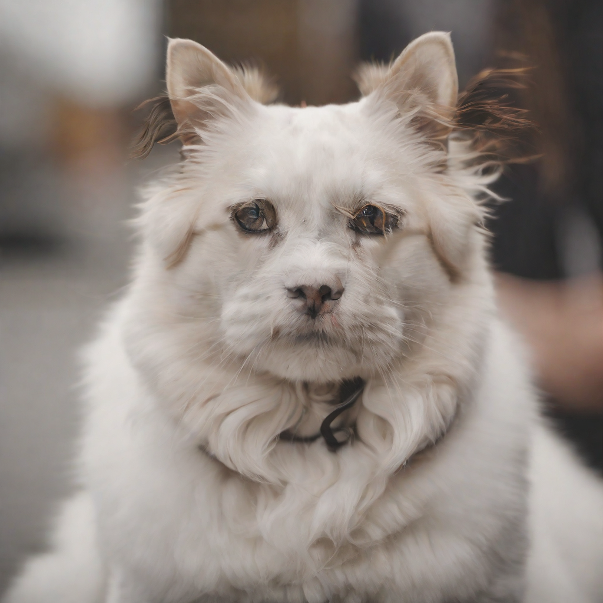

# 🌍 PoE composition (and Mono, the target it is compared against)

Product-of-Experts (PoE) composition is the method under study: a way to make SDXL draw two
named concepts at once by combining two separate single-concept predictions at every denoising
step, instead of retraining the model or hand-writing a joint prompt. It is the thing that fails
(see [chimera.md](chimera.md)) and the thing the project's fix (see
[lora-corrector.md](lora-corrector.md)) is trying to repair. Sibling file
[interaction-term.md](interaction-term.md) explains the specific gap between PoE and its target.

*This is the failure mode by default: PoE has fused the two animals into one creature rather than
placing a cat and a dog side by side.*

## Table of contents

- [Words this file uses](#words-this-file-uses)
- [What PoE composition is](#what-poe-composition-is)
- [What it looks like](#what-it-looks-like)
- [Why the project cares](#why-the-project-cares)
- [How it shows up in the data](#how-it-shows-up-in-the-data)
- [What people get wrong](#what-people-get-wrong)
- [Where this came from](#where-this-came-from)

## Words this file uses

Navigation: 📋 [TOC](#table-of-contents) | [Next](#what-poe-composition-is) ➡️

- **Expert**: one of the two single-concept predictions PoE combines, e.g. the model's prediction
  for "a cat" alone, and separately for "a dog" alone.
- **Denoising step**: diffusion generation runs a fixed schedule of steps (here, 50) that turn
  pure noise into an image; each step's prediction can be combined differently.
- **Mono**: the alternative to PoE — literally typing the joint prompt ("a cat and a dog") and
  letting the model handle composition itself. Used only as the target the fix is measured
  against, never shipped as the method, because typing every joint prompt by hand is the thing
  PoE composition exists to avoid.

## What PoE composition is

Navigation: ⬅️ [Words this file uses](#words-this-file-uses) | 📋 [TOC](#table-of-contents) | [Next](#what-it-looks-like) ➡️

**At every denoising step, PoE runs the model once per concept and combines the two predictions
into one, instead of running the model once on a joint prompt.** ✅

Read directly from the paper's own description (`paper/iclr/iclr2027_conference.tex`, abstract):
composing pretrained diffusion models "at inference time by sampling from a product of experts,
one expert per concept." The combination is a form of linear score composition: each expert's
prediction is added (with classifier-free guidance weighting) rather than the model being asked to
reason about both concepts together in one forward pass. ✅

**Mono is the same model, given the literal joint prompt instead.** ✅

`monolithic.png` in a pilot cell is the Mono render: one forward pass of SDXL on "a cat and a
dog" together. It usually succeeds at showing both concepts, because the model was trained on
image-caption pairs that already describe multiple things together. It is the ceiling PoE is
compared against, not a proposed method, per `MASTER_PLAN.md`'s glossary: "Mono / the ceiling: the
cheat that works... it composes fine, but it defeats the point, so we only use it as the target." ✅

## What it looks like

Navigation: ⬅️ [What PoE composition is](#what-poe-composition-is) | 📋 [TOC](#table-of-contents) | [Next](#why-the-project-cares) ➡️

*Both animals are recognisable and separated, unlike the PoE render above. This is the target the
correction tries to reach without ever seeing this joint prompt at inference.*

Both images are existing pipeline output, copied from `data/pilot/seed_42/a_cat__x__a_dog/` on
2026-08-24, not newly captured.

## Why the project cares

Navigation: ⬅️ [What it looks like](#what-it-looks-like) | 📋 [TOC](#table-of-contents) | [Next](#how-it-shows-up-in-the-data) ➡️

**The gap between the PoE render and the Mono render, step by step, is exactly what the project
tries to measure and then close.** ✅

That gap is named and defined in [interaction-term.md](interaction-term.md). Whether the project's
LoRA composes "like Mono" is the whole test, per
[purpose/03-what-working-means.md](../purpose/03-what-working-means.md#the-test).

## How it shows up in the data

Navigation: ⬅️ [Why the project cares](#why-the-project-cares) | 📋 [TOC](#table-of-contents) | [Next](#what-people-get-wrong) ➡️

| Column | Stands for | Example | Entry |
|---|---|---|---|
| `arm` | which render method produced a given cell: PoE, Mono, or a corrected variant | `poe` (example) | [Dictionary § arm](../data/02-dictionary.md#arm) |
| `model_id` | the exact pretrained model both PoE and Mono run on | `stabilityai/stable-diffusion-xl-base-1.0` | [Dictionary § model_id](../data/02-dictionary.md#model_id) |

## What people get wrong

Navigation: ⬅️ [How it shows up in the data](#how-it-shows-up-in-the-data) | 📋 [TOC](#table-of-contents) | [Next](#where-this-came-from) ➡️

**Mono is not a candidate fix.** ✍️ It is only ever the reference the correction is scored
against. A result that quietly lets the sampler fall back to the Mono prediction at full
correction strength would make every method look equally good for the wrong reason; this is
recorded as a real risk the project checked for (`RESEARCH_GUIDELINES.md`: "a full-strength
shortcut would have made every control row reproduce the real one... switching it off during
control runs is a decision recorded in the design plan").

## Where this came from

Navigation: ⬅️ [What people get wrong](#what-people-get-wrong) | 📋 [TOC](#table-of-contents)

| What | How it was established | When |
|---|---|---|
| PoE combines one expert prediction per concept per step | Read in `paper/iclr/iclr2027_conference.tex`, abstract | 2026-08-24 |
| Mono is the joint-prompt cheat, used only as the target | Read in `MASTER_PLAN.md`, Glossary | 2026-08-24 |
| The two example images | Read directly, `data/pilot/seed_42/a_cat__x__a_dog/{poe,monolithic}.png` | 2026-08-24 |
| The full-strength shortcut risk and its fix | Read in `RESEARCH_GUIDELINES.md` | 2026-08-24 |
