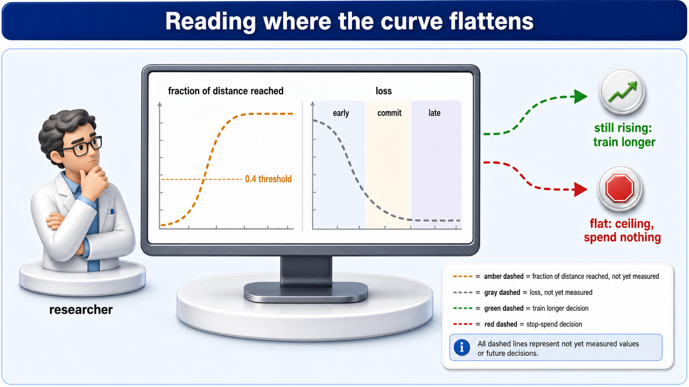
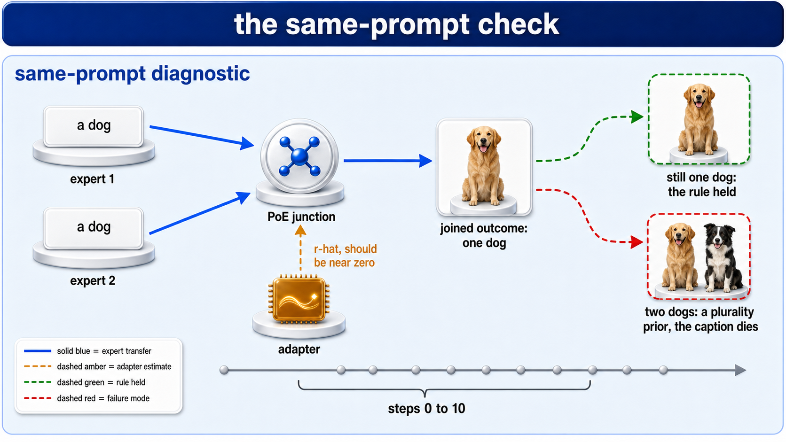
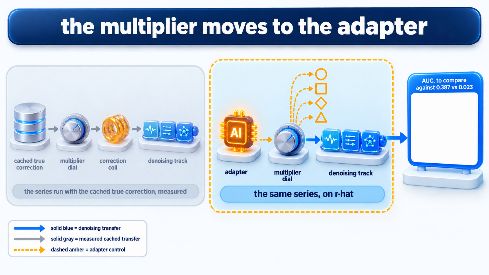
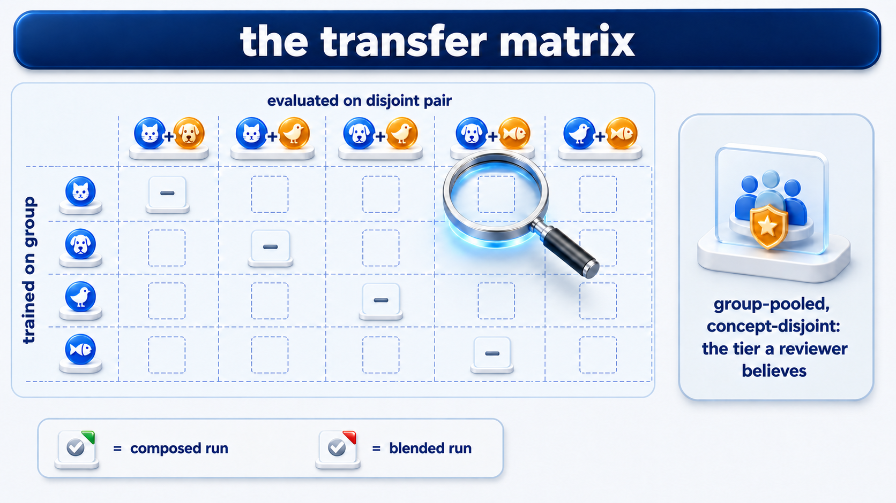
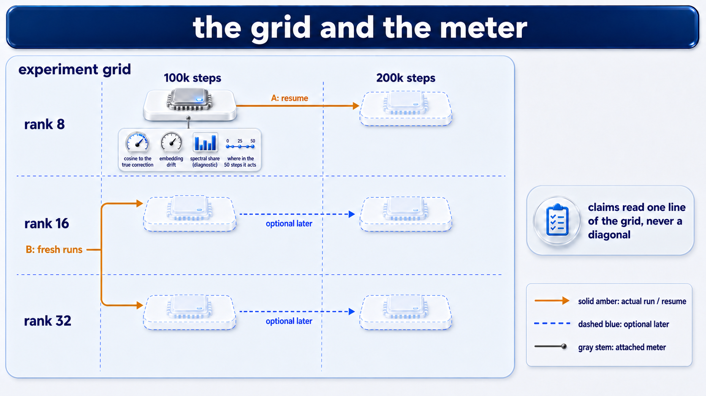
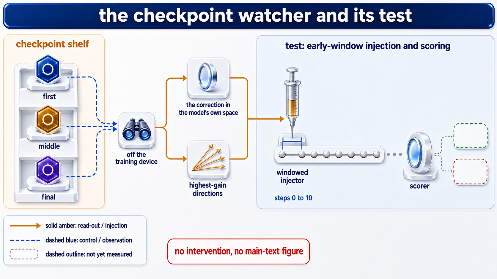
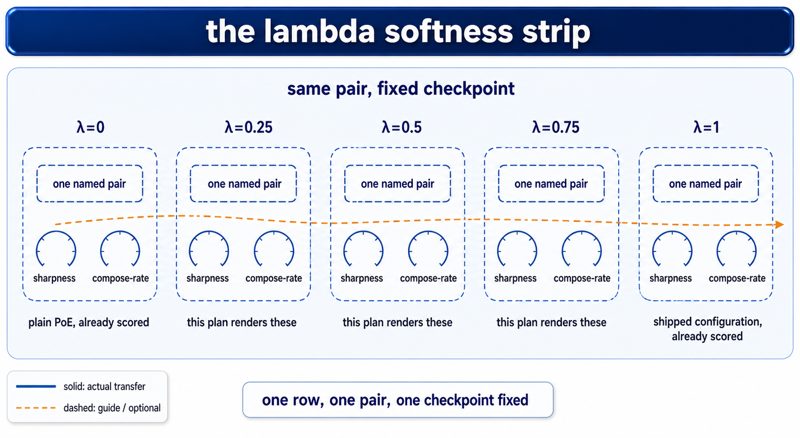
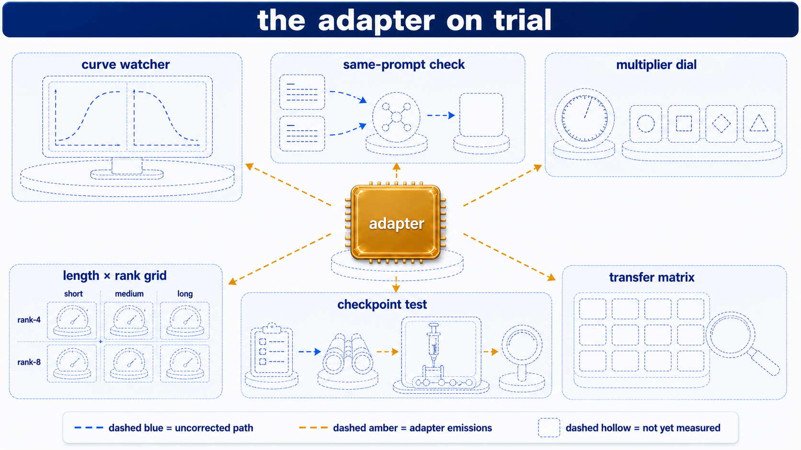
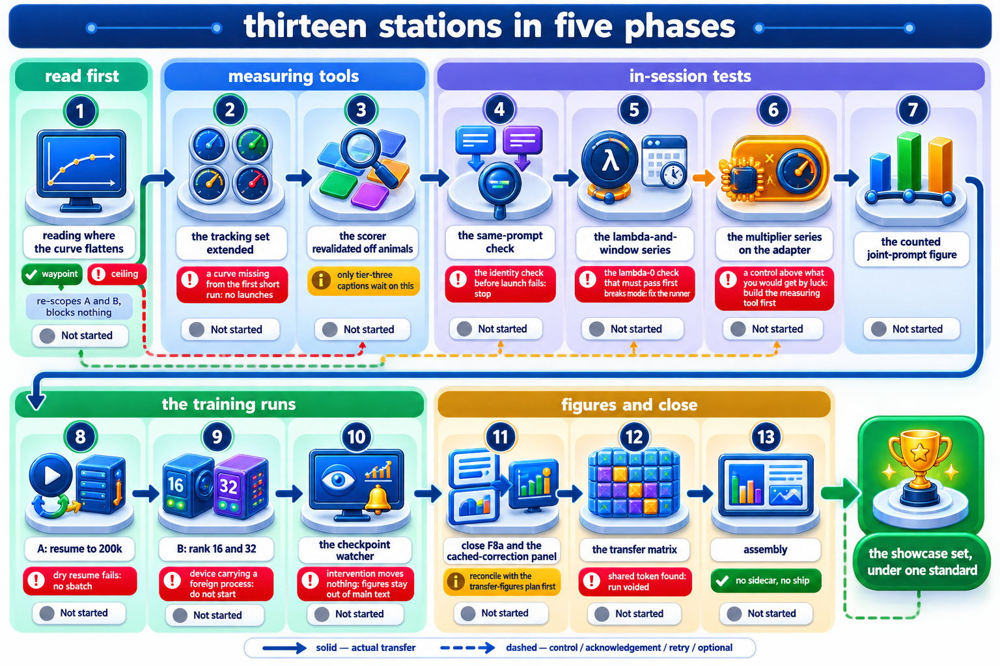
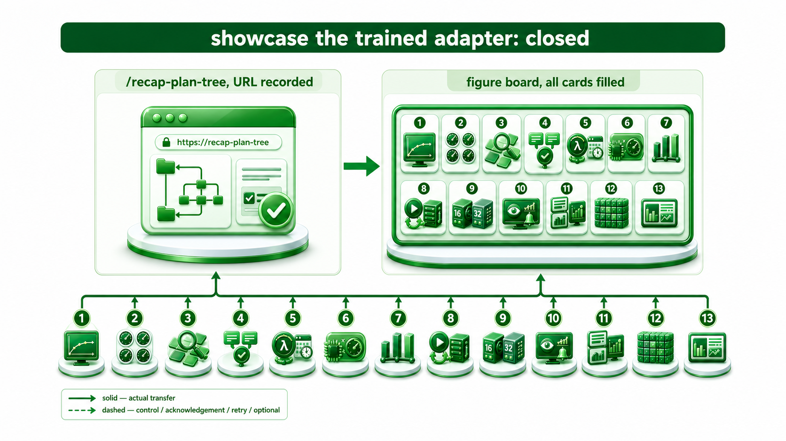

# Showcase the trained adapter: illustrated map

The scope's pictures. Everything here is marked [planned] and drawn dashed: nothing is built yet,
and the map says so truthfully.

**10 prompts · 10 rendered · 0 waiting**

## Abstraction chain

1. [Closing the compositional gap](../diagram-prompts.md): the parent map; this scope inherits
   its art direction, palette, glyphs and reading axes.
2. [Showcase the trained adapter](diagram-prompts.md): subject capstone "the adapter on trial", process capstone "the scope closed".

## Art direction

**Vivid circuit**, inherited from the parent map, verbatim style paragraph at the head of every
prompt. Palette inherited: blue the uncorrected PoE path, amber the correction and anything
carrying it, green a threshold met, red a null result (the numbers came out no different from doing
nothing) or a failure; a control is a hollow amber outline.
Glyphs inherited: cache stack, correction coil, denoising track, multiplier dial, window bracket,
adapter chip, scorer lens, figure board, outcome tile, researcher persona.

## Subject lane

### Prompt 1 (Subject): reading where the curve flattens [planned]

🖼️ rendered 2026-09-01: `diagrams/reading-where-the-curve-flattens.png`
Save as: `diagrams/reading-where-the-curve-flattens.png`

*Both curves dashed to mean not yet measured; the 0.4 threshold line is written before the run.*

> Style: premium system-design infographic. Clean white or very light gray background. Glossy semi-3D icons with soft drop shadows, one icon per component, sitting on subtle rounded platforms. Flows drawn as vivid color-coded directional arrows, each color meaning exactly one kind of traffic, with a small legend inside the image. Solid lines are actual transfers; dashed lines are reserved for control, acknowledgement, retry, and optional paths. Related components grouped inside rounded soft-tinted panels with a short title on the panel. A bold title banner across the top. Clean sans-serif labels under every icon. Generous spacing, no clutter, no watermark.
>
> A monitor showing two rising-then-flat curves, drawn dashed to mean not yet measured: an amber curve labeled "fraction of distance reached" flattening at a dashed line labeled "0.4 threshold", and a gray loss curve beside it split into three bands labeled "early", "commit", "late". A researcher persona reads the monitor; two dashed exit arrows leave it, one green labeled "still rising: train longer", one red labeled "flat: ceiling, spend nothing". Legend inside the image.

Faithfulness note: Both curves are dashed, because nothing has been measured yet. The 0.4 line is the threshold written before the run, not a measurement, and the two exits are equally weighted because either answer is a real result.

### Prompt 2 (Subject): the same-prompt check [planned]

🖼️ rendered 2026-09-01: `diagrams/the-same-prompt-check.png`
Save as: `diagrams/the-same-prompt-check.png`

*Both expert cards read the same word; the correction is labeled a should-be, not a measured value.*

> Style: premium system-design infographic. Clean white or very light gray background. Glossy semi-3D icons with soft drop shadows, one icon per component, sitting on subtle rounded platforms. Flows drawn as vivid color-coded directional arrows, each color meaning exactly one kind of traffic, with a small legend inside the image. Solid lines are actual transfers; dashed lines are reserved for control, acknowledgement, retry, and optional paths. Related components grouped inside rounded soft-tinted panels with a short title on the panel. A bold title banner across the top. Clean sans-serif labels under every icon. Generous spacing, no clutter, no watermark.
>
> Two expert cards both reading "a dog" feed blue arrows into a PoE junction; the junction's outcome tile shows one dog. An adapter chip attaches from below with an amber arrow labeled "r-hat, should be near zero", drawn dashed. Two dashed outcome tiles to the right: green "still one dog: the rule held" and red "two dogs: a plurality prior, the caption dies". A small window bracket labeled "steps 0 to 10" sits on the denoising track beneath.

Faithfulness note: Both expert cards must read the same word, and the amber arrow says 'should be near zero' rather than 'is', because the test has not run. The red exit is the one that kills the plurality caption, so it is drawn no smaller than the green.

### Prompt 3 (Subject): the multiplier moves to the adapter [planned]

🖼️ rendered 2026-09-01: `diagrams/the-multiplier-moves-to-the-adapter.png`
Save as: `diagrams/the-multiplier-moves-to-the-adapter.png`

*The left panel is measured and faded; the right, on the adapter, is dashed because it has not run.*

> Style: premium system-design infographic. Clean white or very light gray background. Glossy semi-3D icons with soft drop shadows, one icon per component, sitting on subtle rounded platforms. Flows drawn as vivid color-coded directional arrows, each color meaning exactly one kind of traffic, with a small legend inside the image. Solid lines are actual transfers; dashed lines are reserved for control, acknowledgement, retry, and optional paths. Related components grouped inside rounded soft-tinted panels with a short title on the panel. A bold title banner across the top. Clean sans-serif labels under every icon. Generous spacing, no clutter, no watermark.
>
> Left panel faded: a cache stack feeding a multiplier dial and a correction coil into the denoising track, labeled "the series run with the cached true correction, measured". Right panel drawn dashed and prominent: the adapter chip feeding the same multiplier dial and denoising track, labeled "the same series, on r-hat". Four hollow amber control outlines queue beside the dial. A figure board at the far right holds one empty card labeled "AUC, to compare against 0.387 vs 0.023".

Faithfulness note: The left panel is faded because that series is measured and done; the right is dashed because it has not run. The two AUC numbers on the figure board's card, 0.387 for the real correction against 0.023 for the random one, come from the series run with the cached true correction, and belong to the left panel's work, never to the right.

### Prompt 4 (Subject): the transfer matrix [planned]

🖼️ rendered 2026-09-01 (1 revision: the first attempt drew scored checkmarks with green/red verdicts on every tile, which asserted results that do not exist; corrected to hollow dashed placeholders): `diagrams/the-transfer-matrix.png`
Save as: `diagrams/the-transfer-matrix.png`

*Every tile is an empty dashed placeholder: no run in this grid has been scored yet.*

> Style: premium system-design infographic. Clean white or very light gray background. Glossy semi-3D icons with soft drop shadows, one icon per component, sitting on subtle rounded platforms. Flows drawn as vivid color-coded directional arrows, each color meaning exactly one kind of traffic, with a small legend inside the image. Solid lines are actual transfers; dashed lines are reserved for control, acknowledgement, retry, and optional paths. Related components grouped inside rounded soft-tinted panels with a short title on the panel. A bold title banner across the top. Clean sans-serif labels under every icon. Generous spacing, no clutter, no watermark.
>
> A grid of outcome tiles, rows labeled "trained on group", columns labeled "evaluated on disjoint pair", drawn dashed. A scorer lens hovers over one tile. Green and red corner chips mark composed and blended runs. A side caption card: "group-pooled, concept-disjoint: the tier a reviewer believes".

Faithfulness note: Every tile is dashed, because no run is scored yet. Rows are training groups and columns are disjoint evaluation pairs, so no tile on the diagonal may be drawn as a claim.

### Prompt 5 (Subject): the grid and the meter [planned]

🖼️ rendered 2026-09-01 (1 revision: the first attempt drew three extra platforms solid with filled meters, implying trained runs that do not exist; corrected to hollow, meter-free placeholders): `diagrams/the-grid-and-the-meter.png`
Save as: `diagrams/the-grid-and-the-meter.png`

*Only rank 8 at 100k is a real trained artifact; every other platform is dashed and carries no meter.*

> Style: premium system-design infographic. Clean white or very light gray background. Glossy semi-3D icons with soft drop shadows, one icon per component, sitting on subtle rounded platforms. Flows drawn as vivid color-coded directional arrows, each color meaning exactly one kind of traffic, with a small legend inside the image. Solid lines are actual transfers; dashed lines are reserved for control, acknowledgement, retry, and optional paths. Related components grouped inside rounded soft-tinted panels with a short title on the panel. A bold title banner across the top. Clean sans-serif labels under every icon. Generous spacing, no clutter, no watermark.
>
> A two-by-three grid of platforms, columns labeled "100k steps" and "200k steps", rows labeled "rank 8", "rank 16", "rank 32", drawn dashed. The rank-8-at-100k platform is solid (it exists); an amber arrow labeled "A: resume" runs right along the rank-8 row; two amber arrows labeled "B: fresh runs" rise into the rank-16 and rank-32 platforms of the 100k column; the 200k platforms of ranks 16 and 32 are faded with a dashed arrow labeled "optional later". A small meter panel attaches to every solid platform: four miniature gauges labeled "cosine to the true correction", "embedding drift", "spectral share (diagnostic)", "where in the 50 steps it acts". A caption card: "claims read one line of the grid, never a diagonal".

Faithfulness note: Exactly one platform is solid, rank 8 at 100k, because that is the only trained artifact that exists. The caption is load-bearing: a claim reads one row or one column, never a diagonal across both.

### Prompt 6 (Subject): the checkpoint watcher and its test [planned]

🖼️ rendered 2026-09-01: `diagrams/the-checkpoint-watcher-and-its-test.png`
Save as: `diagrams/the-checkpoint-watcher-and-its-test.png`

*The watcher runs off the training device; both outcome chips are dashed, since the test has not run.*

> Style: premium system-design infographic. Clean white or very light gray background. Glossy semi-3D icons with soft drop shadows, one icon per component, sitting on subtle rounded platforms. Flows drawn as vivid color-coded directional arrows, each color meaning exactly one kind of traffic, with a small legend inside the image. Solid lines are actual transfers; dashed lines are reserved for control, acknowledgement, retry, and optional paths. Related components grouped inside rounded soft-tinted panels with a short title on the panel. A bold title banner across the top. Clean sans-serif labels under every icon. Generous spacing, no clutter, no watermark.
>
> A checkpoint shelf (three highlighted places labeled "first", "middle", "final") feeding a small watcher glyph on its own platform labeled "off the training device", drawn dashed. Two amber read-out arrows leave the watcher: one into a bottleneck lens labeled "the correction in the model's own space", one into a fan of thin arrows labeled "highest-gain directions". Both converge on a syringe-like injector over the denoising track, its window bracket pinned at steps 0 to 10, ending at a scorer lens with green and red outcome chips. A red caption chip: "no intervention, no main-text figure".

Faithfulness note: The watcher sits on its own platform, off the training device, which is a real constraint and not decoration. The window bracket is pinned at steps 0 to 10, the measured injection window, and the red caption states the condition under which none of this reaches the main text.

### Prompt 7 (Subject): the lambda-softness strip [planned]

🖼️ rendered 2026-09-01: `diagrams/the-lambda-softness-strip.png`
Save as: `diagrams/the-lambda-softness-strip.png`

*All five platforms are dashed, including the two endpoints captioned already scored: nothing in this row is re-drawn as a result.*

> Style: premium system-design infographic. Clean white or very light gray background. Glossy semi-3D icons with soft drop shadows, one icon per component, sitting on subtle rounded platforms. Flows drawn as vivid color-coded directional arrows, each color meaning exactly one kind of traffic, with a small legend inside the image. Solid lines are actual transfers; dashed lines are reserved for control, acknowledgement, retry, and optional paths. Related components grouped inside rounded soft-tinted panels with a short title on the panel. A bold title banner across the top. Clean sans-serif labels under every icon. Generous spacing, no clutter, no watermark.
>
> A single row of five hollow dashed platforms, one named pair carried through all five, labeled "λ=0" through "λ=1" left to right. Each platform holds a paired frame outline and a small meter pair: a sharpness gauge and a compose-rate gauge, both empty. A dashed amber curve traces across the five sharpness gauges, unfilled. The λ=0 platform is captioned "plain PoE, already scored" and the λ=1 platform "shipped configuration, already scored"; the three between are captioned "this plan renders these". A caption card: "one row, one pair, one checkpoint fixed".

Faithfulness note: All five platforms are dashed because no point in this row has been measured yet, including the λ=0 and λ=1 endpoints, which are captioned as already scored elsewhere but not re-drawn as solid here. The sharpness curve is drawn unfilled, since a monotone rise is the thing being tested for, not asserted.

### Subject capstone: the adapter on trial [planned]

🖼️ rendered 2026-09-01 (1 revision: a station label read "multiplier sweep", reintroducing a word this whole pass removed; renamed to "multiplier dial"): `diagrams/subject-capstone-the-adapter-on-trial.png`
Save as: `diagrams/subject-capstone-the-adapter-on-trial.png`

*All six stations drawn dashed; only the adapter chip is solid, and nothing here asserts a result.*

> Style: premium system-design infographic. Clean white or very light gray background. Glossy semi-3D icons with soft drop shadows, one icon per component, sitting on subtle rounded platforms. Flows drawn as vivid color-coded directional arrows, each color meaning exactly one kind of traffic, with a small legend inside the image. Solid lines are actual transfers; dashed lines are reserved for control, acknowledgement, retry, and optional paths. Related components grouped inside rounded soft-tinted panels with a short title on the panel. A bold title banner across the top. Clean sans-serif labels under every icon. Generous spacing, no clutter, no watermark.
>
> One canvas composing six stations around the adapter chip at center: the monitor with the flattening curves (top left), the two agreeing expert cards with their same-prompt-check outcome tiles (top center), the multiplier dial with its hollow controls (top right), the two-by-three length-and-rank grid with its miniature meter panels (bottom left), the checkpoint watcher with its injector and scorer lens (bottom center), and the transfer grid under the scorer lens (bottom right). Blue arrows carry the uncorrected path, amber arrows everything the adapter emits, all stations drawn dashed on dashed platforms. Legend inside the image; title banner "the adapter on trial".

Faithfulness note: Six stations, each recognisably the same glyph as its own prompt, all drawn dashed. The adapter chip is the only thing at centre; nothing in this image asserts a result.

## Process lane

Version 02, regenerated by populate-plans from the thirteen plan files; snapshot in
[diagrams/process-versions/02-2026-08-29.md](diagrams/process-versions/02-2026-08-29.md).
The checks and failure paths come from the plans' engagement checks, none invented.

### Prompt 1 (Process): thirteen stations in five phases [planned]

🖼️ rendered 2026-09-01: `diagrams/process-thirteen-stations-in-five-phases.png`
Save as: `diagrams/process-thirteen-stations-in-five-phases.png`

*All thirteen stations read Not started; every red check chip quotes a real engagement check, none invented.*

> Style: premium system-design infographic. Clean white or very light gray background. Glossy semi-3D icons with soft drop shadows, one icon per component, sitting on subtle rounded platforms. Flows drawn as vivid color-coded directional arrows, each color meaning exactly one kind of traffic, with a small legend inside the image. Solid lines are actual transfers; dashed lines are reserved for control, acknowledgement, retry, and optional paths. Related components grouped inside rounded soft-tinted panels with a short title on the panel. A bold title banner across the top. Clean sans-serif labels under every icon. Generous spacing, no clutter, no watermark.
>
> One route left to right through five rounded phase panels, thirteen numbered stations, status chips all "Not started". Panel "read first" holds station 1 "reading where the curve flattens" (monitor glyph; exit chips green "waypoint" and red "ceiling", both continuing, chip caption "re-scopes A and B, blocks nothing"). Panel "measuring tools" holds station 2 "the tracking set extended" (four miniature gauges; red check chip "a curve missing from the first short run: no launches") and station 3 "the scorer revalidated off animals" (scorer lens over non-animal tiles; chip "only tier-three captions wait on this"). Panel "in-session tests" holds station 4 "the same-prompt check" (red check "the identity check before launch fails: stop"), station 5 "the lambda-and-window series" (red check "the lambda-0 check that must pass first breaks mode: fix the runner"), station 6 "the multiplier series on the adapter" (red check "a control above what you would get by luck: build the measuring tool first"), and station 7 "the counted joint-prompt figure" (three bars beside a short track). Panel "the training runs" holds station 8 "A: resume to 200k" (red check "dry resume fails: no sbatch"), station 9 "B: rank 16 and 32" (red check "device carrying a foreign process: do not start"), and station 10 "the checkpoint watcher" (watcher glyph; red chip "intervention moves nothing: figures stay out of main text"). Panel "figures and close" holds station 11 "close F8a and the cached-correction panel" (chip "reconcile with the transfer-figures plan first"), station 12 "the transfer matrix" (red chip "shared token found: run voided"), and station 13 "assembly" (figure board; check chip "no sidecar, no ship"). The route ends at a green banner "the showcase set, under one standard".

Faithfulness note: Thirteen stations, five phases, every status chip reading 'Not started', which is true of the whole scope. Each red check chip quotes a real engagement check from the plan of that number; none is invented.

### Process capstone: the scope closed [planned]

🖼️ rendered 2026-09-01: `diagrams/process-capstone-the-scope-closed.png`
Save as: `diagrams/process-capstone-the-scope-closed.png`

*The only green image in the map: this shows the scope finished, not its current status.*

> Style: premium system-design infographic. Clean white or very light gray background. Glossy semi-3D icons with soft drop shadows, one icon per component, sitting on subtle rounded platforms. Flows drawn as vivid color-coded directional arrows, each color meaning exactly one kind of traffic, with a small legend inside the image. Solid lines are actual transfers; dashed lines are reserved for control, acknowledgement, retry, and optional paths. Related components grouped inside rounded soft-tinted panels with a short title on the panel. A bold title banner across the top. Clean sans-serif labels under every icon. Generous spacing, no clutter, no watermark.
>
> The thirteen stations shrunk along the bottom edge, all green; above them the recall-gallery page glyph labeled "/recap-plan-tree, URL recorded" and the figure board holding its filled cards. Title banner "showcase the trained adapter: closed".

Faithfulness note: This is the only image in the map drawn green, and it depicts a future state: the scope closed. It must be readable as an end state, never as a status report.
