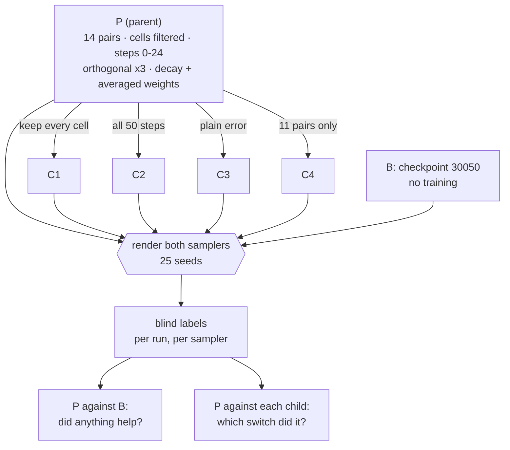

# 🧪 The parent and the four children: which of the five changes makes the render clean?

**One training run puts five changes on at once. Four more each undo exactly one of them. All five are rendered under both samplers and judged blind against checkpoint 30050, so the scope ends knowing both whether the adapter got better and which switch did it.**

**Step 69 in the root running order. Waits on steps 66 and 67 to launch, and on step 68 to be read. Feeds step 70, the sheet.**

## Recommended prompt (after this plan completes)

```
/sync-plan-tree @plans/08-improve-the-rank-32-pooled-adapter/plans/hypothesis/04-the-parent-and-the-four-children.md — the chain run, the five W&B run ids, the blind label tables per run and per sampler, and the verdict for the parent and each child in the review file
```

---

## Position in the plan tree

| Step | Plan | What it does |
|------|------|-------------|
| 68 (previous) | [03: what the stacked sampler alone does](../baselines/03-what-the-stacked-sampler-alone-does.md) | the baseline column these runs are read against |
| **69 (current)** | **04: the parent and the four children** | five training runs, one axis apart, judged blind under both samplers |
| 70 (next) | [05: the comparison sheet](../figures/05-the-comparison-sheet.md) | the filed sheet built from whichever run won |

---

## Table of contents

- [Position in the plan tree](#position-in-the-plan-tree)
- [Words this plan uses](#words-this-plan-uses)
- [Quick context: where you are](#quick-context-where-you-are)
- [Considerations](#considerations)
- [Environment Facts This Plan Depends On](#environment-facts-this-plan-depends-on)
- [The claim](#the-claim)
- [Why this plan exists](#why-this-plan-exists)
- [What happens (visual)](#what-happens-visual)
- [Description: what to build](#description-what-to-build)
- [Purpose and goal](#purpose-and-goal)
- [Tasks](#tasks)
- [Instructions](#instructions)
- [What has to pass before this runs](#what-has-to-pass-before-this-runs)
- [Figure Catalog](#figure-catalog)
- [Orchestration: keeping catalogs and plan files in sync](#orchestration-keeping-catalogs-and-plan-files-in-sync)
- [Code references](#code-references)
- [Recommended skill](#recommended-skill)
- [Next step](#next-step)
- [Error Matrix](#error-matrix)

---

## Words this plan uses

⬅️ [Previous](#position-in-the-plan-tree) | 📋 [TOC](#table-of-contents) | [Next](#quick-context-where-you-are) ➡️

- **The parent, P**: a rank-32 pooled adapter trained for 30,000 steps with five changes on at once. The pool is 14 pairs rather than 11. Training cells whose joint target fails the both-names read are dropped. Training samples denoising steps 0 to 24 only. The part of the error outside the two experts' span is charged three times. The optimizer uses weight decay 1e-2 and keeps an averaged copy of the weights at decay 0.999, at a constant learning rate of 1e-4.
- **The four children**: **C1** keeps every cell. **C2** samples all 50 denoising steps. **C3** uses the plain error with no extra charge on the orthogonal part. **C4** uses the original 11 pairs only. Each is the parent with exactly one change undone; the optimizer setting is undone by none of them, so it is shared by all five.
- **The baseline, B**: checkpoint 30050, no training, from [plan 03](../baselines/03-what-the-stacked-sampler-alone-does.md).
- **Better than the baseline, under the same sampler**: more seeds labelled clean, and no seed the baseline had clean falling out of that label.
- **A child's switch mattered**: the parent is better than that child by the same rule. If the parent is not better than the child, the change that child undoes did not carry the improvement.
- **Shipped and stacked**: the two samplers, defined in [plan 03](../baselines/03-what-the-stacked-sampler-alone-does.md#words-this-plan-uses). Every run is rendered and judged under both.

---

## Quick context: where you are

⬅️ [Previous](#words-this-plan-uses) | 📋 [TOC](#table-of-contents) | [Next](#considerations) ➡️

**The experiment.** Five trainings in a chain on one device overnight, then a probe pass per checkpoint, then a blind label pass per run per sampler.

**The hypothesis.** The rank-32 adapter's held-out renders are unclean because it is trained on some targets that show the wrong animals, because it is trained on the late steps where the softness lives, and because it spends its capacity on the part of the correction the two experts could already supply. Fixing all three, and widening the pool, gives more clean seeds than checkpoint 30050 under the same sampler.

**If true.** The parent beats the baseline by the rule, at least one child is worse than the parent, and the scope ends with a better checkpoint and a named cause.

**If false.** The parent does not beat the baseline. That closes the data-side and loss-side route as a package, which is worth knowing, because the alternatives left are a better teacher than the joint prompt and an inference-time fix, and both are more expensive.

**If the parent wins and no child is worse than it.** No single switch carries the improvement. Either they matter jointly, or the gain came from the pool being larger, which C4 is the one child positioned to catch.

**What would surprise.** C2 better than the parent. That says training on the late steps helps even though running the adapter there hurts, which nothing currently predicts, and it would make the late-step question the finding rather than a settled assumption.

**Dataset.** Training: 14 pairs, 108 cells before exclusions and 28 after them, per [plan 01's review](../../review/01-the-three-switches-and-the-guidance-interval.md#asked-after-the-result). Judging: all 17 cached cat × dog seeds and all 8 elephant × penguin seeds, none of which the runs train on.

**Associated materials.**
- Review questions: [the review file](../../review/04-the-parent-and-the-four-children.md)
- The launch procedure: [launch the chain of five runs](../../procedures/hypothesis-04-launch-the-chain.md)
- The labelling procedure: [run the blind label pass](../../procedures/tools-02-run-the-blind-label-pass.md)
- The design: [the run design](../../../../artifacts/ideas/improving-the-pooled-lora-run/run-design-parent-and-children.md)

---

## Considerations

⬅️ [Previous](#quick-context-where-you-are) | 📋 [TOC](#table-of-contents) | [Next](#environment-facts-this-plan-depends-on) ➡️

**Cost.** Rank 32 steps at about 0.24 s on the Blackwell, so 30,000 steps is roughly two hours plus eval passes; the design's own estimate was four to six hours per run on 116 cells, which was written before the exclusion was counted; on 28 cells it is faster. Five in a chain is about twelve hours, one night. The probe pass adds about 40 minutes per run. Labelling is about twenty minutes per run per sampler, so roughly three hours of a person's time across all five.

**Buys.** A better checkpoint if there is one, and the attribution: which of the five changes carried it. Without the children the scope would end knowing only that something helped.

**Prerequisites.** Steps 66 and 67 complete. Step 68's verdict is needed to read the results, not to launch them, so the chain may cook while the baseline is being labelled.

**Output root.** `/datasets/mmolefe/poe_repair_min/outputs/showcase/improve_r32/`, one subdirectory per run.

**W&B project.** `prime_lab/poe-repair-animals-compose`, one run per training, tagged `parent` or `child`.

**Memory.** Rank 32 needs about 25 GB. On the Blackwell it fits as it is. On a 3090 it needs gradient checkpointing, which the trainer already supports.

**Run state lives in the review file, never here.** No run ids, no job numbers, no status in this file. The `## Runs` table in the review file is where a launch is recorded.

**Known issues:** see the [Error Matrix](#error-matrix).

---

## Environment Facts This Plan Depends On

⬅️ [Previous](#considerations) | 📋 [TOC](#table-of-contents) | [Next](#the-claim) ➡️

- **One Blackwell is free.** `mscluster112` read idle on 2026-09-08; `mscluster110` is carrying another user's job and `mscluster111` is hardware-faulted and stays off the list until an administrator resets it ([nodes](../../../../environment/hpc/nodes.md)). Re-check this before launching, because it is a fact with a date on it.
- **`co3_bw` on the Blackwell, never `co3`.** A `co3` CUDA operation there produces no output rather than an error ([nodes](../../../../environment/hpc/nodes.md)).
- **`biggpu` allows one job per user**, so the chain runs over SSH with `nohup` rather than through Slurm, and is invisible to `squeue`. Harvest with `pgrep` on the node ([execution protocol](../../../../environment/hpc/execution-protocol.md)).
- **Every path on the launch line is absolute**, and the launcher is copied under the run's output root on `/datasets` before launch, because `/tmp` is node-local and a relative path resolves against the home directory rather than the repository ([execution protocol](../../../../environment/hpc/execution-protocol.md)).
- **The disk guard checks `/datasets`**, the filesystem the run actually writes to ([storage](../../../../environment/storage.md)).
- **Harvest over SSH on the node itself.** The session node's view of `/datasets` lags by minutes, so a checkpoint count read from the session node can be wrong.
- **Never edit the launcher while it is running.** Bash reads a script by byte offset, so an edit mid-run corrupts what it executes next.

---

## The claim

⬅️ [Previous](#environment-facts-this-plan-depends-on) | 📋 [TOC](#table-of-contents) | [Next](#why-this-plan-exists) ➡️

**The parent gives more clean cat × dog seeds than checkpoint 30050 under the same sampler and loses none it had clean, and at least one child is worse than the parent by the same rule, naming the switch that carried it.**

**Why this matters right now:** checkpoint 30050 is what the paper's adapter figures are measured from. A better checkpoint moves those figures; a named cause is what turns the improvement into a method sentence rather than a lucky configuration.

---

## Why this plan exists

⬅️ [Previous](#the-claim) | 📋 [TOC](#table-of-contents) | [Next](#what-happens-visual) ➡️

**The problem.** Five earlier single-axis runs each moved one thing and none removed the softness: weight decay, an averaged copy of the weights, a per-step loss weighting, a price on the adapter's own energy, and three inference-time fixes. The remaining ideas are all data-side or loss-side, and there are four of them.

**The approach.** Rather than five more single-axis runs, put all of them on at once and remove them one at a time. That is the same information for the same number of runs, and it front-loads the answer that matters most: whether the package works at all lands first, in the parent.

**Key insights.**

1. **Leave one out, rather than add one in.** If nothing helps, five add-one-in runs all read null and nothing is learned. With leave-one-out, the parent answers the "does anything help" question by itself, and the children only have to be read if it does.
2. **The children are an ablation and answer to the ablation's rules.** One component per run, everything else held. A component that turns out not to matter is a finding stated plainly, because it simplifies the method.
3. **The order in the chain is chosen so the most informative runs land first.** The parent, then C2 which tests the late-step mask, the change most likely to matter. If the night is cut short, those two are the ones on disk.
4. **The exclusion list over-flags on purpose, and C1 is what measures the cost.** The both-names read is known to over-flag on visually similar pairs, so dropping cells by it may throw away good training data. C1 keeps every cell, which is the only way to see whether that cost exceeds the benefit.

---

## What happens (visual)

⬅️ [Previous](#why-this-plan-exists) | 📋 [TOC](#table-of-contents) | [Next](#description-what-to-build) ➡️



The chain runs in the order P, C2, C1, C3, C4, so the parent and the child most likely to matter land first.

---

## Description: what to build

⬅️ [Previous](#what-happens-visual) | 📋 [TOC](#table-of-contents) | [Next](#purpose-and-goal) ➡️

1. **Five run configurations**, one per row of the run set, each differing from the parent in exactly one flag. Written as five config files or five launcher lines, so a diff between any child and the parent is one line long and can be read as such.
2. **The launcher**, on `/datasets`, running the five in order, continuing to the next if one dies and saying so in the log, with the three mandatory guards in it: a disk guard on `/datasets` aborting at 90%, a `co3_bw` python path check, and a device guard refusing a GPU over 1 GB in use or reading no state at all. Node, device and process id in the log header.
3. **The 200-step smoke of the parent**, run and killed before the chain, to see the W&B run appear with its panels, a checkpoint land on `/datasets`, and the step time near 0.24 s.
4. **The probe pass per checkpoint**, plan 02's tool, rendering both samplers' strips and logging them plus the two secondary reads into that run's own W&B record by id.
5. **The blind label pass per run per sampler**, and the join producing ten label tables.
6. **The verdicts**: the parent against the baseline, and the parent against each child, each by the constants in source.

---

## Purpose and goal

⬅️ [Previous](#description-what-to-build) | 📋 [TOC](#table-of-contents) | [Next](#tasks) ➡️

**Purpose.** Serves the scope's objectives 1 and 2: five changes on together with each removed once, and every render judged by eye, blind, against a read fixed before launch.

**Goals.**

1. Five trainings reach 30,000 steps, each with its own W&B run id recorded in the review file.
2. Every run has strips under both samplers over all 25 seeds, on W&B.
3. Ten blind label tables exist, one per run per sampler.
4. The parent's verdict against the baseline is written by the rule in source.
5. Each child's verdict against the parent is written by the same rule, and any switch that did not matter is stated plainly.

---

## Tasks

⬅️ [Previous](#purpose-and-goal) | 📋 [TOC](#table-of-contents) | [Next](#instructions) ➡️

**For Claude to execute.** Ask Claude to do these.

### 0. 🧭 Check this plan before working from it

- [ ] **0.1** Check this plan conforms and its instructions are concrete, before acting on it.
  - Paste: `/verify-plan @plans/08-improve-the-rank-32-pooled-adapter/plans/hypothesis/04-the-parent-and-the-four-children.md`
  - Done when: the report comes back clean, or its proposals have been applied.
- [ ] **0.2** Cross-reference this plan's terms against `context/`, `environment/`, `runbook/` and `report/`.
  - Paste: `/xref-pillar @plans/08-improve-the-rank-32-pooled-adapter/plans/hypothesis/04-the-parent-and-the-four-children.md`
  - Done when: the scan returns no candidates, or its proposed links have been applied.

▶ **Next: [task 1.1](#1--fix-the-verdict-rule-in-source-before-launch)**.

### 1. 🔬 Fix the verdict rule in source, before launch

◀ **Needs: [task 0.1](#0--check-this-plan-before-working-from-it)**.

- [ ] **1.1 Write the better-than rule as constants** in the scoring script, so it cannot be adjusted once the labels are in without appearing in a diff.
  - `MIN_CLEAN_GAIN = 1` and `MAX_CLEAN_LOST = 0`, applied identically to the parent against the baseline and to the parent against each child.
  - **Done when:** the constants exist and both branches are computed from them, not written by hand.

▶ **Next: [task 2.1](#2--build-the-five-configurations-and-the-launcher)**.

### 2. 🔧 Build the five configurations and the launcher

◀ **Needs: [task 1.1](#1--fix-the-verdict-rule-in-source-before-launch)** done, and [plan 01's dry run](../tools/01-the-three-switches-and-the-guidance-interval.md#4--dry-run-the-parent-configuration) passed.

- [ ] **2.1 Write the five run configurations**, each differing from the parent by one flag.
  - **Done when:** `diff` between the parent's configuration and each child's is a single line, printed and checked, which is the mechanical form of the one-axis rule.
- [ ] **2.2 Write the chain launcher** at `scripts/showcase/improve_r32_launch_chain.sh` in the repository, running P, C2, C1, C3, C4 in that order.
  - It lives in the repository because that is the copy that gets edited and version-controlled; [the launch procedure](../../procedures/hypothesis-04-launch-the-chain.md#2-copy-the-launcher-onto-the-shared-disk) copies it to `/datasets/.../improve_r32/launch_chain.sh` and that copy is the one that runs.
  - Its interface, which the procedure depends on: `GPU=<index>` selects the device, `SMOKE=1` runs the 200-step smoke of the parent alone and exits, and `--dry-run` prints the five commands without executing them. The log header prints the node, the device index and the process id, each on its own line, with the process id line beginning `PID` so the procedure can read it back without a pattern match.
  - Three guards, all mandatory: a disk guard on `/datasets` aborting at 90%, a check that the Blackwell python exists at `/home-mscluster/mmolefe/miniforge3/envs/co3_bw/bin/python`, and a device guard refusing a GPU over 1 GB in use or reporting no readable state.
  - **Done when:** `--dry-run` prints the five commands in order with absolute paths, each guard reports what it checked, and the header's `PID` line is present.
- [ ] **2.3 Print the composition each configuration actually builds**, per run: cells kept per pair, distinct training steps, orthogonal weight.
  - Turning one knob can move another through the data. If a child's cell count differs from the parent's for any reason other than the switch it undoes, the comparison is already mixed.
  - **Done when:** the five printed compositions differ only where the switch says they should, checked line by line.

▶ **Next: [instruction 4.1](#4--claim-the-device-and-launch-the-chain)**.

### 3. 🚀 Probe every checkpoint once the chain is done

◀ **Needs: [instruction 4.3](#4--claim-the-device-and-launch-the-chain)**, the harvest, so the checkpoints exist.

- [ ] **3.1 Run the probe pass over each of the five checkpoints**, rendering both samplers' strips over all 25 seeds and logging them plus the count and both-names reads into that run's own W&B record by id.
  - **Done when:** each of the five W&B runs shows 50 strip images and a both-names metric, and the run id in each probe's log matches the training run it was pointed at.
- [ ] **3.2 Build the strips and hide the names** through plan 02's builder, one set per run per sampler.
  - **Done when:** ten `tiles.json` files exist, each with 100 tiles carrying ids, counts and both-names outcomes and no condition names.

▶ **Next: [instruction 5.1](#5--label-every-run-blind-and-write-the-verdicts)**.

## Instructions

⬅️ [Previous](#tasks) | 📋 [TOC](#table-of-contents) | [Next](#what-has-to-pass-before-this-runs) ➡️

**For you to follow manually.** Do these yourself.

### 4. 🖥️ Claim the device and launch the chain

◀ **Needs: [task 2.3](#2--build-the-five-configurations-and-the-launcher)** done, so the configurations are known to differ on one axis each.

4.1 **Read [the launch procedure](../../procedures/hypothesis-04-launch-the-chain.md) to completion, then follow it.**
   - It covers checking which Blackwell is actually free today, copying the launcher to `/datasets`, running the 200-step smoke, killing it, launching the chain, and the verify line.
   - ✅ The verify line shows the training process running on the node and the log's header naming the node, the device and the process id.
   - ❌ The device guard refuses: the procedure's own branch says what to do, and it is not "try again immediately".

4.2 **Record the launch in the [review file's Runs table](../../review/04-the-parent-and-the-four-children.md#runs)**: node, device, process id, the five W&B run ids as they appear, and the launch time.
   - This is the only place run state lives. Nothing goes in the plan file.

4.3 **Harvest, over SSH on the node itself, not from the session node.**
   - `pgrep -af train_pooled` for what is running, then count checkpoints under each run's output directory, then read the tail of the chain log.
   - ✅ Five run directories, each with a checkpoint at 30,000 steps.
   - ❌ Fewer: the log names which run died and the chain moved on. Record it in the Runs table and read the runs that did finish; a chain that lost one run is not a chain that failed.

▶ **Next: [task 3.1](#3--probe-every-checkpoint-once-the-chain-is-done)**.

### 5. 👁️ Label every run blind, and write the verdicts

◀ **Needs: [task 3.2](#3--probe-every-checkpoint-once-the-chain-is-done)** done, so the strips exist with their names hidden.

5.1 **Label the ten sets** through [the labelling procedure](../../procedures/tools-02-run-the-blind-label-pass.md), one per run per sampler.
   - Take them in separate sittings rather than in one pass, and shuffle the order you take the runs in, so fatigue does not land on the same run every time.
   - ✅ Ten label tables, each with 100 entries.

5.2 **Run the join, and read the parent against the baseline first.**
   - Under each sampler: the parent's clean count, the baseline's, and the per-seed list of what changed.
   - ✅ The branch is printed from the constants in task 1.1.
   - ❌ The parent gains clean seeds but also loses one the baseline had: by the rule that is not better, and it is recorded as not better rather than argued around.

5.3 **Then read the parent against each child**, same rule, and write one line per child saying whether its switch mattered.
   - A switch that did not matter is stated plainly. It simplifies the method rather than embarrassing it.

5.4 **Write every verdict into the [review file](../../review/04-the-parent-and-the-four-children.md)**, with the clean counts and the W&B run id beside each.

▶ **Next: [the close out](#close-out--record-what-this-plan-taught)**.

### Close out. 🔄 Record what this plan taught

◀ **Needs:** every group above attempted, including any run that died.

- [ ] **Capture the failures this plan hit.**
  - Paste: `/ingest-error-pattern --from-run-log @plans/08-improve-the-rank-32-pooled-adapter/plans/hypothesis/04-the-parent-and-the-four-children.md`
  - Run after any red run. Done when: each failure has a catalog entry, or there were none.
- [ ] **Bring the tree current.**
  - Paste: `/sync-plan-tree @plans/08-improve-the-rank-32-pooled-adapter/plans/hypothesis/04-the-parent-and-the-four-children.md — the chain, the five run ids, the ten label tables, and the verdicts`
  - Done when: statuses, the running order and the Error Matrix match reality.

▶ **Next: [what has to pass before this runs](#what-has-to-pass-before-this-runs)**.

---

## What has to pass before this runs

⬅️ [Previous](#instructions) | 📋 [TOC](#table-of-contents) | [Next](#figure-catalog) ➡️

> **Why this checkpoint matters:** twelve hours of the only free Blackwell, and a comparison that is worthless if two things moved between a child and the parent.

**Pass criteria:**
- The verdict constants exist in source before launch.
- Each child's configuration differs from the parent's by exactly one line.
- The printed composition per run differs only where the switch says it should.
- The 200-step smoke shows the W&B run with its panels, a checkpoint on `/datasets`, and a step time near 0.24 s.
- Five runs reach 30,000 steps, or the log names which died and why.

**Fail criteria (STOP):**
- A child's cell count differs from the parent's for a reason other than the switch it undoes: the axes are not independent and every comparison along that axis is already mixed. Fix the configuration and relaunch rather than reading the result.
- The smoke's step time is far off 0.24 s: something other than the intended device is running the job, and twelve hours of chain would land somewhere unexpected.

**Partial pass:** if the chain lands the parent and C2 but not the rest, the parent's verdict against the baseline may be written and C2's switch judged. The remaining three children stay open and are stated as open, never as null.

**When you get results, answer the questions in the [review file](../../review/04-the-parent-and-the-four-children.md).**

---

## Figure Catalog

⬅️ [Previous](#what-has-to-pass-before-this-runs) | 📋 [TOC](#table-of-contents) | [Next](#orchestration-keeping-catalogs-and-plan-files-in-sync) ➡️

### Pending: to be generated from prompts

| Item | Lane | Prompt file | What it shows | Save to |
|------|------|-------------|---------------|---------|
| The five changes, and the four runs that each undo one | subject | [diagram-prompts.md](../../diagram-prompts.md#prompt-2-subject-the-five-changes-and-the-four-runs-that-each-undo-one) | the parent's five controls, each child flipping one back, the baseline standing apart | `diagrams/improve-r32-02-five-changes-four-runs-that-undo-one.png` |
| Five runs on one machine, overnight | subject | [diagram-prompts.md](../../diagram-prompts.md#prompt-5-subject-five-runs-on-one-machine-overnight) | the three machines, the guards, the ordered queue, the tracker | `diagrams/improve-r32-05-five-runs-on-one-machine-overnight.png` |
| Which cells the adapter is allowed to learn from | subject | [diagram-prompts.md](../../diagram-prompts.md#prompt-1-subject-which-cells-the-adapter-is-allowed-to-learn-from) | the pool this plan's runs actually train on | `diagrams/improve-r32-01-which-cells-the-adapter-learns-from.png` |

### Generated during execution

| Item | Lane | Description | Generated by | Status | Details |
|------|------|-------------|--------------|--------|---------|
| per-run strips, both samplers | — | 25 seeds per run per sampler, on W&B beside that run's training curves | task 3.1 | ⏳ generated during run | one W&B run per training |
| the ten label tables | — | label, count and both-names per tile, joined to the condition | instruction 5.2 | ⏳ generated during run | `<run>/labels_joined.csv` |
| training curves and thumbnails | — | compose rate, the tracking thumbnails, the adapter's weight norm | the trainer | ⏳ generated during run | W&B, per run |

### Organization workflow

1. Strips and label tables stay under each run's output root and in its W&B record.
2. Only [plan 05's sheet](../figures/05-the-comparison-sheet.md) reaches `artifacts/results/`, built from the winning run's columns.

---

## Orchestration: keeping catalogs and plan files in sync

⬅️ [Previous](#figure-catalog) | 📋 [TOC](#table-of-contents) | [Next](#code-references) ➡️

| Step | Command | Triggered by | Outcome |
|------|---------|--------------|---------|
| Check the plan | `/verify-plan @...hypothesis/04-the-parent-and-the-four-children.md` | **task 0.1**, before any work | conformance and thin instructions reported |
| Cross-reference the plan | `/xref-pillar @...hypothesis/04-the-parent-and-the-four-children.md` | **task 0.2**, before any work | terms already documented elsewhere linked |
| Capture patterns | `/ingest-error-pattern --from-run-log` | **the close out**, after any red run | errors added to the catalogs |
| Bring the tree current | `/sync-plan-tree @...hypothesis/04-the-parent-and-the-four-children.md` | **the close out** | statuses, running order and Error Matrix match reality |

---

## Code references

⬅️ [Previous](#orchestration-keeping-catalogs-and-plan-files-in-sync) | 📋 [TOC](#table-of-contents) | [Next](#recommended-skill) ➡️

**File:** `poe_repair/experiments/cross_pair_lora_pooling/train_pooled.py`
**Relevant section:** the trainer, with the three switches added by [plan 01](../tools/01-the-three-switches-and-the-guidance-interval.md) beside the existing `--weight-decay`, `--ema-decay`, `--gradient-checkpointing` and `--rank`.

The parent's line, which each child changes in exactly one place:

```bash
--pair-pool      /home-mscluster/mmolefe/Playground/PhD/poe_repair_min/artifacts/_shared/cross_pair_pool_configs/pair_pool_14.yaml \
--pair-prompts   /home-mscluster/mmolefe/Playground/PhD/poe_repair_min/artifacts/_shared/cross_pair_pool_configs/pair_prompts_14.yaml \
--seed-pool-path /home-mscluster/mmolefe/Playground/PhD/poe_repair_min/artifacts/_shared/cross_pair_pool_configs/seed_pool.yaml \
--exclude-cells  /datasets/mmolefe/poe_repair_min/outputs/showcase/improve_r32/exclude_cells.json \
--train-step-range 0 24 --orth-weight 3.0 \
--lora-rank 32 --lora-alpha 32 --weight-decay 1e-2 --ema-decay 0.999 --lr 1e-4 \
--total-epochs 600 --epoch-size 50
```

Run length is counted in epochs: 600 epochs at 50 steps each is the 30,000 steps the design asks for. Each child changes exactly one of these lines, and C4 changes `--pair-pool` to the eleven-pair file rather than removing a flag.

**File:** `poe_repair/paths.py:150`
**Relevant section:** `GROUP_POOL_CONFIGS`, where the 14-pair yaml has to live.

**File:** the probe pass extended by [plan 02](../tools/02-the-blind-label-pass.md)
**Relevant section:** `--probe`, which renders both samplers and resumes an existing W&B run by id.

---

## Recommended skill

⬅️ [Previous](#code-references) | 📋 [TOC](#table-of-contents) | [Next](#next-step) ➡️

▶ `/analyze-run <the parent's W&B run id>` ✅ once the parent's training finishes, to read its curves and thumbnails before the probe pass runs.

alt: `/run-experiment` ✅ for the launch itself. Not promoted into a task line here, because the launch is a six-step procedure with real branches (which device is free today, what to do when the guard refuses) and it is written out as [its own procedure file](../../procedures/hypothesis-04-launch-the-chain.md) instead. Running the skill would flatten those branches into a single dispatch.

---

## Next step

⬅️ [Previous](#recommended-skill) | 📋 [TOC](#table-of-contents)

[05: the comparison sheet](../figures/05-the-comparison-sheet.md) takes whichever run won and builds the one sheet this scope files.

---

## Error Matrix

⬅️ [Previous](#next-step) | 📋 [TOC](#table-of-contents)

<details>
<summary>No failures catalogued yet</summary>

**Purpose**: known issues and their fixes, regenerated by `/ingest-error-pattern` and `/sync-plan-tree`.

#### From global catalog

#### From project catalog

---

**Auto-update note:** regenerated by `/sync-plan-tree`. Do not edit by hand.

</details>
