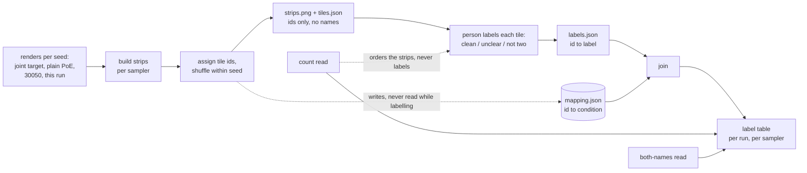

# 🔬 The blind label pass: the read that decides this scope

**The count scorer calls most of checkpoint 30050's held-out renders composed, and by eye most of them are not a clean cat and a clean dog. So the verdict in this scope is assigned by eye, blind, and this plan builds the thing that makes that possible: the strips, the shuffle that hides which condition is which, the three-label table, and the two automatic reads that sit beside the labels and never decide them.**

**Step 67 in the root running order. Waits on step 66 for the guidance interval, since the stacked strips cannot be rendered without it. Gates steps 68, 69 and 70: nothing in this scope can be judged until the read exists.**

## Recommended prompt (after this plan completes)

```
/sync-plan-tree @plans/08-improve-the-rank-32-pooled-adapter/plans/tools/02-the-blind-label-pass.md — the strip builder, the blinding, the label table, the two secondary reads and the known-example smoke, with the smoke's results in the review file
```

---

## Position in the plan tree

| Step | Plan | What it does |
|------|------|-------------|
| 66 (previous) | [01: the three switches and the guidance interval](01-the-three-switches-and-the-guidance-interval.md) | the sampler change this plan's stacked strips need |
| **67 (current)** | **02: the blind label pass** | the read: strips, hidden names, three labels, two secondary reads |
| 68 (next) | [03: what the stacked sampler alone does](../baselines/03-what-the-stacked-sampler-alone-does.md) | the first thing this read is pointed at |

---

## Table of contents

- [Position in the plan tree](#position-in-the-plan-tree)
- [Words this plan uses](#words-this-plan-uses)
- [Quick context: where you are](#quick-context-where-you-are)
- [Considerations](#considerations)
- [Environment Facts This Plan Depends On](#environment-facts-this-plan-depends-on)
- [The claim](#the-claim)
- [Why this plan exists](#why-this-plan-exists)
- [What happens (visual)](#what-happens-visual)
- [Description: what to build](#description-what-to-build)
- [Purpose and goal](#purpose-and-goal)
- [Tasks](#tasks)
- [Instructions](#instructions)
- [What has to pass before this runs](#what-has-to-pass-before-this-runs)
- [Figure Catalog](#figure-catalog)
- [Orchestration: keeping catalogs and plan files in sync](#orchestration-keeping-catalogs-and-plan-files-in-sync)
- [Code references](#code-references)
- [Recommended skill](#recommended-skill)
- [Next step](#next-step)
- [Error Matrix](#error-matrix)

---

## Words this plan uses

⬅️ [Previous](#position-in-the-plan-tree) | 📋 [TOC](#table-of-contents) | [Next](#quick-context-where-you-are) ➡️

- **A strip**: one row of four picture tiles, all from the same random seed. The joint prompt's own picture, the picture with no correction at all, checkpoint 30050's picture, and the run being judged.
- **The two samplers**: **shipped** is the adapter on all 50 steps, deterministic, guidance 7.5 throughout. **Stacked** is the adapter on steps 0 to 24 with the frozen model finishing, fresh randomness at every step, and guidance 7.5 only from step 5 to 35. Every run is rendered both ways and judged separately under each.
- **Blind**: the four tiles carry opaque ids rather than condition names, and their order within a strip is shuffled per seed. The mapping from id to condition is written to a separate file that the labelling step never opens.
- **The three labels**: **clean** is both named animals present, each clearly itself, nothing unnatural on inspection. **unclear** is two animals but not clearly the two named ones, or clearly both but with unnatural details. **not two** is one animal, a single blended creature, or the same animal twice.
- **The count read**: the validated detector's count of animal-shaped regions. It cannot tell a cat and a dog from two cats, and it cannot see softness, which is why it is not the verdict.
- **The both-names read**: each detected region is cropped and CLIP picks between the pair's two names; the picture passes when both names win at least one region. It over-flags on visually similar pairs.
- **The probe pass**: an inference-only pass over a saved checkpoint that renders its strips and logs them into that checkpoint's existing W&B run rather than starting a new one.

---

## Quick context: where you are

⬅️ [Previous](#words-this-plan-uses) | 📋 [TOC](#table-of-contents) | [Next](#considerations) ➡️

**The system.** A read, in four parts: build the strips, hide which tile is which, collect one label per tile, and log two automatic measurements beside the labels without letting them touch the labels.

**What it does.** It turns "the renders look wrong to me" into a table that can be compared between runs and checked afterwards. Six of the eight held-out cat × dog seeds from checkpoint 30050 are described in [the run design's problem table](../../../../artifacts/ideas/improving-the-pooled-lora-run/run-design-parent-and-children.md), and the count scorer calls most of them composed. No number currently in this repository sees that defect.

**How this is judged.** As an instrument, by whether it can fail. Two properties have to hold. The blinding has to be structural rather than a promise: labels are recorded against tile ids and only a separate join step resolves an id to a condition. And the labels have to separate examples whose answer is already known: a known blended creature must come back **not two**, and a joint-prompt render of a seed whose target is right must come back **clean**.

**Associated materials.**
- Review questions: [the review file](../../review/02-the-blind-label-pass.md)
- The procedure a person follows to actually label: [run the blind label pass](../../procedures/tools-02-run-the-blind-label-pass.md)
- The read as designed: [the run design](../../../../artifacts/ideas/improving-the-pooled-lora-run/run-design-parent-and-children.md), the "The read, written before launch" section

---

## Considerations

⬅️ [Previous](#quick-context-where-you-are) | 📋 [TOC](#table-of-contents) | [Next](#environment-facts-this-plan-depends-on) ➡️

**Cost.** Rendering is the expense, not the labelling: 25 seeds under two samplers is 50 renders per condition, about 40 minutes per run on one card. The labelling itself is roughly 100 tiles per run per sampler and takes a person about twenty minutes.

**Buys.** The verdict for every plan in this scope, and a per-seed record that a later reader can re-judge without re-rendering.

**Prerequisites.** Step 66's guidance interval, for the stacked strips. The joint-target and plain-PoE renders for all 17 cat × dog and 8 elephant × penguin seeds, which mostly exist already under the showcase output roots; any missing ones are rendered here. The validated compose scorer. The rank-32 checkpoint at 30050.

**Output root.** `/datasets/mmolefe/poe_repair_min/outputs/showcase/improve_r32/read/`.

**W&B project.** `prime_lab/poe-repair-animals-compose`. The probe pass logs into an existing run by id rather than creating one, so a checkpoint's strips sit beside its training curves.

**The adapter-still-attached trap.** The windowed sampler leaves the adapter enabled outside its window, so a plain-PoE or joint-target reference rendered in the same process after a checkpoint has been loaded is not actually a reference. Render every reference before any adapter is attached, or in a separate process. This has already cost one re-render in this repository.

**The sharpness trap.** Laplacian variance counts edges, so a drawn or engraved texture scores as sharper than a photograph. It is not one of the two secondary reads here, and it must not be added as a third without a labelled counter-example.

**Known issues:** see the [Error Matrix](#error-matrix).

---

## Environment Facts This Plan Depends On

⬅️ [Previous](#considerations) | 📋 [TOC](#table-of-contents) | [Next](#the-claim) ➡️

- **Renders and strips go under `/datasets`**, never `/home-mscluster` ([storage](../../../../environment/storage.md)).
- **The probe pass is inference only** and fits on the session node's card, so it does not compete with the training chain for the Blackwell ([throughput](../../../../environment/hpc/throughput.md)).
- **`XFORMERS_DISABLED=1`** is needed for the CPU DINOv2 path used by the secondary reads.
- **W&B resume by run id** is how the strips reach the training run; a new run per probe would scatter one checkpoint's evidence across two places.

---

## The claim

⬅️ [Previous](#environment-facts-this-plan-depends-on) | 📋 [TOC](#table-of-contents) | [Next](#why-this-plan-exists) ➡️

**A person can label every render in this scope without knowing which condition produced it, the mapping survives so the blinding can be checked afterwards, and the two automatic reads reach the table without reaching the label.**

**Why this matters right now:** the whole scope rests on a judgement the available metrics cannot make. If the judgement is not blind, it is a preference for whichever run was expected to win.

---

## Why this plan exists

⬅️ [Previous](#the-claim) | 📋 [TOC](#table-of-contents) | [Next](#what-happens-visual) ➡️

**The problem.** The defect is visible and unmeasured. Blended features, unresolved limbs, an animal that is neither, a human-like figure standing where a dog should be: the count read passes all of these because two animal-shaped regions are present.

**The approach.** Keep the eye as the instrument and remove what makes an eye unreliable. Hide the condition, shuffle the order, fix the three labels before any render exists, and record the mapping separately so the blinding is checkable rather than asserted.

**Key insights.**

1. **Blinding has to be structural.** A promise not to look is not a control. Recording labels against tile ids, and resolving ids to conditions only in a later join, is what makes the blinding a property of the tool rather than of the person's discipline.
2. **The secondary reads earn their place by ordering, not by deciding.** Sorting strips by count and both-names puts the interesting rows first and saves time. Letting either one into the verdict would reintroduce exactly the blindness this plan exists to route around.
3. **An instrument is judged by whether it can fail.** Hence the known-example smoke: examples whose answer is already settled, run through the whole pass, before it is pointed at anything unknown.

---

## What happens (visual)

⬅️ [Previous](#why-this-plan-exists) | 📋 [TOC](#table-of-contents) | [Next](#description-what-to-build) ➡️



The dotted line into the person is the ordering the two automatic reads are allowed to do. There is no solid line from either of them into the label.

---

## Description: what to build

⬅️ [Previous](#what-happens-visual) | 📋 [TOC](#table-of-contents) | [Next](#purpose-and-goal) ➡️

1. **The strip builder** (`--build`): per seed and per sampler, one row of four tiles at a size a person can judge, written with tile ids rather than condition names, plus `tiles.json` recording seed, sampler and id per tile. Covers all 17 cached cat × dog seeds and all 8 elephant × penguin seeds.
2. **The blinding** (`--build`, same pass): a per-seed shuffle of tile order and an id assignment, with `mapping.json` written to a sibling directory the labelling step has no reason to open.
3. **The label collector** (`--label`): presents one strip at a time and records one of the three labels per tile into `labels.json`, keyed by id. Refuses to run if `labels.json` already holds an entry for an id, so a second pass cannot quietly overwrite a first.
4. **The join** (`--join`): resolves ids to conditions using `mapping.json` and emits the label table per run and per sampler, with the count and both-names reads joined in as columns beside the labels.
5. **The two secondary reads** (`--score`): the validated detector's count and the forced-choice both-names read, run over every tile at build time so the strips can be ordered before labelling.
6. **The probe pass** (`--probe`): points at a saved checkpoint, renders its strips under both samplers, and logs them plus `eval/both_names` into that checkpoint's existing W&B run by id.
7. **The known-example smoke** (`--smoke`): the whole pass over a small set whose answers are already settled, asserting each expected label.

---

## Purpose and goal

⬅️ [Previous](#description-what-to-build) | 📋 [TOC](#table-of-contents) | [Next](#tasks) ➡️

**Purpose.** Serves the scope's objective 2: every render is judged by eye, blind, against a read fixed before launch, with the scorer's numbers demoted to ordering.

**Goals.**

1. Strips exist for both samplers over all 25 seeds, carrying ids and no condition names.
2. `mapping.json` is written to a separate directory and is not opened by the labelling step.
3. `labels.json` records one label per tile and refuses to overwrite an existing entry.
4. The join emits the label table per run and per sampler, with count and both-names as columns.
5. The known-example smoke passes: a settled blended creature reads **not two**, a settled clean joint-target render reads **clean**.

---

## Tasks

⬅️ [Previous](#purpose-and-goal) | 📋 [TOC](#table-of-contents) | [Next](#instructions) ➡️

**For Claude to execute.** Ask Claude to do these.

### 0. 🧭 Check this plan before working from it

- [ ] **0.1** Check this plan conforms and its instructions are concrete, before acting on it.
  - Paste: `/verify-plan @plans/08-improve-the-rank-32-pooled-adapter/plans/tools/02-the-blind-label-pass.md`
  - Done when: the report comes back clean, or its proposals have been applied.
- [ ] **0.2** Cross-reference this plan's terms against `context/`, `environment/`, `runbook/` and `report/`.
  - Paste: `/xref-pillar @plans/08-improve-the-rank-32-pooled-adapter/plans/tools/02-the-blind-label-pass.md`
  - Done when: the scan returns no candidates, or its proposed links have been applied.

▶ **Next: [task 1.1](#1--gather-the-references-before-any-adapter-is-attached)**.

### 1. 🔧 Gather the references before any adapter is attached

◀ **Needs: [task 2.1 of plan 01](01-the-three-switches-and-the-guidance-interval.md#2--write-the-guidance-interval-and-hold-it-against-todays-render)**, so the stacked sampler exists.

- [ ] **1.1 Inventory the joint-target and plain-PoE renders** for all 17 cat × dog and 8 elephant × penguin seeds under the existing showcase output roots, and list what is missing.
  - **Done when:** a printed table names every seed and says present or missing per reference, per sampler.
- [ ] **1.2 Render whatever is missing, in a process with no adapter loaded.**
  - The windowed sampler leaves the adapter enabled outside its window, so a reference rendered after a checkpoint has been loaded is not a reference. Render these first, or in a separate process.
  - **Done when:** every cell of task 1.1's table reads present, and the log shows no checkpoint load before the reference stage.

▶ **Next: [task 2.1](#2--build-the-strips-the-blinding-and-the-two-secondary-reads)**.

### 2. 🔧 Build the strips, the blinding and the two secondary reads

◀ **Needs: [task 1.2](#1--gather-the-references-before-any-adapter-is-attached)** done, so all four tiles exist for every seed.

- [ ] **2.1 Write the strip builder and the blinding** into `scripts/showcase/blind_label.py`, writing `strips/`, `tiles.json` and, to a sibling directory, `mapping.json`.
  - Every mode takes `--set <name>`, where a set name is the run and the sampler joined by a hyphen: `baseline-shipped`, `baseline-stacked`, `P-shipped`, `C1-stacked` and so on. The plan that sends a labeller here names the set.
  - **Done when:** a built strip shows no condition name anywhere in the image or in `tiles.json`, and the same seed's tile order differs from the on-disk condition order.
- [ ] **2.2 Wire the two secondary reads** over every tile: the validated detector's count and the forced-choice both-names read.
  - Run with `XFORMERS_DISABLED=1` for the CPU DINOv2 path.
  - **Done when:** every tile in `tiles.json` carries a count and a both-names outcome, and the strips can be ordered by either.
- [ ] **2.3 Write the label collector and the join**, `labels.json` keyed by id and the join emitting the per-run, per-sampler table.
  - **Done when:** the collector refuses a second label for an id already present, with a message naming that id, and the join's output carries one row per tile with label, count and both-names.

▶ **Next: [task 3.1](#3--prove-the-read-can-fail)**.

### 3. 🔬 Prove the read can fail

◀ **Needs: [task 2.3](#2--build-the-strips-the-blinding-and-the-two-secondary-reads)** done.

- [ ] **3.1 Assemble the known-example set**: renders whose label is already settled, drawn from the existing showcase outputs. At minimum one blended single creature, one render showing the same animal twice, and one joint-target render of a seed whose target is right.
  - **Done when:** the set exists with its expected label recorded per example, written before the smoke runs.
- [ ] **3.2 Run the whole pass over the known-example set** and assert each expected label.
  - **Done when:** the smoke reports every expected label matched, or names the examples that did not and stops.

▶ **Next: [task 4.1](#4--wire-the-probe-pass-into-wb)**.

### 4. 🔌 Wire the probe pass into W&B

◀ **Needs: [task 2.2](#2--build-the-strips-the-blinding-and-the-two-secondary-reads)** done, so there is something to log.

- [ ] **4.1 Extend `lambda_boundary_probe.py`** to take the guidance interval, point at a checkpoint, render both samplers' strips, and log them plus `eval/both_names` into an existing W&B run given by id.
  - **Done when:** the resumed run's media panel shows the strips for both samplers and `eval/both_names` carries a value at that step. A matching run id in the log is not enough, because a probe that resumes the right run and uploads nothing satisfies it.

▶ **Next: [instruction 5.1](#5--label-one-seed-by-hand-and-check-the-blinding-holds)**.

## Instructions

⬅️ [Previous](#tasks) | 📋 [TOC](#table-of-contents) | [Next](#what-has-to-pass-before-this-runs) ➡️

**For you to follow manually.** Do these yourself.

### 5. 👁️ Label one seed by hand, and check the blinding holds

◀ **Needs: [task 3.2](#3--prove-the-read-can-fail)** passed, so the read is known to separate settled cases.

5.1 **Read [the labelling procedure](../../procedures/tools-02-run-the-blind-label-pass.md) to completion, then label one seed with it.**
   - One seed is enough here: this is a check on the tool, not the scope's real read.
   - ✅ You reach four labels without at any point being able to tell which tile is which.
   - ❌ A tile is identifiable, by a filename in a caption, a consistent position, or a watermark: record which and stop; the blinding is not structural yet.

5.2 **Confirm the mapping was not consulted.**
   - Check the modification time on `mapping.json` against the time you started labelling.
   - ✅ Unchanged since the build, and no read is logged by the labelling step.
   - ❌ Otherwise, the join is happening too early and the label table cannot be trusted.

5.3 **Look at the ordering the secondary reads produce.**
   - Sort a run's strips by the count read and skim them.
   - ✅ The ordering puts plausibly-composed rows together, which is all it is for.
   - ❌ The ordering appears to track the labels closely: say so in the review file, because a secondary read that predicts the label is one a future reader will be tempted to substitute for it.

▶ **Next: [the close out](#close-out--record-what-this-plan-taught)**.

### Close out. 🔄 Record what this plan taught

◀ **Needs:** every group above attempted, including any that went red.

- [ ] **Capture the failures this plan hit.**
  - Paste: `/ingest-error-pattern --from-run-log @plans/08-improve-the-rank-32-pooled-adapter/plans/tools/02-the-blind-label-pass.md`
  - Done when: each failure has a catalog entry, or there were none.
- [ ] **Bring the tree current.**
  - Paste: `/sync-plan-tree @plans/08-improve-the-rank-32-pooled-adapter/plans/tools/02-the-blind-label-pass.md — the strip builder, the blinding, the label table, the secondary reads, the smoke's results`
  - Done when: statuses, the running order and the Error Matrix match reality.

▶ **Next: [what has to pass before this runs](#what-has-to-pass-before-this-runs)**.

---

## What has to pass before this runs

⬅️ [Previous](#instructions) | 📋 [TOC](#table-of-contents) | [Next](#figure-catalog) ➡️

> **Why this checkpoint matters:** this read is the verdict for the whole scope. A read that cannot fail on a settled example cannot be believed on an unsettled one, and a blinding that is a promise rather than a property is not a blinding.

**Pass criteria:**
- No condition name appears in a strip image or in `tiles.json`.
- Tile order within a seed differs from the on-disk condition order.
- The label collector refuses to overwrite an existing id's label.
- The known-example smoke matches every expected label.

**Fail criteria (STOP):**
- A tile is identifiable without the mapping: the blinding does not hold and no label taken with it means anything.
- The smoke mislabels a settled example: the three labels as written do not separate the cases they were written to separate, and the definitions need fixing before any run is judged.

**When you get results, answer the questions in the [review file](../../review/02-the-blind-label-pass.md).**

---

## Figure Catalog

⬅️ [Previous](#what-has-to-pass-before-this-runs) | 📋 [TOC](#table-of-contents) | [Next](#orchestration-keeping-catalogs-and-plan-files-in-sync) ➡️

### Pending: to be generated from prompts

| Item | Lane | Prompt file | What it shows | Save to |
|------|------|-------------|---------------|---------|
| The strip, and the read that is done by eye | subject | [diagram-prompts.md](../../diagram-prompts.md#prompt-4-subject-the-strip-and-the-read-that-is-done-by-eye) | the strips, the shuffle, the person, the three labels, and the two reads that order but never judge | `diagrams/improve-r32-04-the-strip-and-the-read-by-eye.png` |

### Generated during execution

| Item | Lane | Description | Generated by | Status | Details |
|------|------|-------------|--------------|--------|---------|
| the strips | — | one row of four tiles per seed per sampler, ids only | task 2.1 | ⏳ generated during run | `read/strips/` under the output root |
| the label table | — | one row per tile: label, count, both-names, resolved condition | task 2.3's join | ⏳ generated during run | `read/labels_joined.csv` |
| the known-example smoke report | — | expected against actual label per settled example | task 3.2 | ⏳ generated during run | `read/smoke/` |

### Organization workflow

1. Strips, labels and the smoke stay under the output root while the scope runs; they are working evidence, not filed results.
2. The sheet that reaches `artifacts/results/` is [plan 05](../figures/05-the-comparison-sheet.md)'s job, built from these tables.

---

## Orchestration: keeping catalogs and plan files in sync

⬅️ [Previous](#figure-catalog) | 📋 [TOC](#table-of-contents) | [Next](#code-references) ➡️

| Step | Command | Triggered by | Outcome |
|------|---------|--------------|---------|
| Check the plan | `/verify-plan @...tools/02-the-blind-label-pass.md` | **task 0.1**, before any work | conformance and thin instructions reported |
| Cross-reference the plan | `/xref-pillar @...tools/02-the-blind-label-pass.md` | **task 0.2**, before any work | terms already documented elsewhere linked |
| Capture patterns | `/ingest-error-pattern --from-run-log` | **the close out**, after any red run | errors added to the catalogs |
| Bring the tree current | `/sync-plan-tree @...tools/02-the-blind-label-pass.md` | **the close out** | statuses, running order and Error Matrix match reality |

---

## Code references

⬅️ [Previous](#orchestration-keeping-catalogs-and-plan-files-in-sync) | 📋 [TOC](#table-of-contents) | [Next](#recommended-skill) ➡️

**File:** `scripts/showcase/lambda_boundary_probe.py`
**Relevant section:** the existing per-checkpoint probe. Task 4.1 adds the guidance interval, the two-sampler strip render, and W&B resume by run id.

**File:** the compose scorer package
**Relevant section:** the validated instance-count rule, which is the count read. It is used unchanged; this plan adds no scorer.

**File:** `poe_repair/methods/_poe_langevin.py`
**Relevant section:** the windowed sampler. Note that the adapter stays enabled outside the window, which is why task 1.2 renders references in a process with no checkpoint loaded.

---

## Recommended skill

⬅️ [Previous](#code-references) | 📋 [TOC](#table-of-contents) | [Next](#next-step) ➡️

— custom; no skill fits. The blinding and the three labels are specific to this scope's defect.

also: `/analyze-figure` ✅ on a built strip, when a label is hard to assign and it helps to have the render described before deciding.

---

## Next step

⬅️ [Previous](#recommended-skill) | 📋 [TOC](#table-of-contents)

[03: what the stacked sampler alone does](../baselines/03-what-the-stacked-sampler-alone-does.md) points this read at checkpoint 30050 under both samplers, which is the first thing that has to be known.

---

## Error Matrix

⬅️ [Previous](#next-step) | 📋 [TOC](#table-of-contents)

<details>
<summary>No failures catalogued yet</summary>

**Purpose**: known issues and their fixes, regenerated by `/ingest-error-pattern` and `/sync-plan-tree`.

#### From global catalog

#### From project catalog

---

**Auto-update note:** regenerated by `/sync-plan-tree`. Do not edit by hand.

</details>
