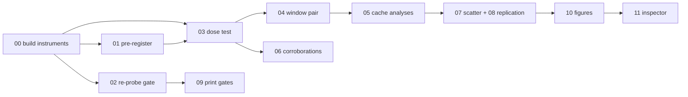

# 📏 Pre-register the correction-size measure

**Step 2 of 22.** Waits on nothing. The one order is the `## Running order` table in the [repo root MASTER_PLAN.md](../../../../../MASTER_PLAN.md).

| Step | Plan | Status |
|---|---|---|
| 1 | ~~[instrument-01-build-the-measuring-scripts](instrument-01-build-the-measuring-scripts.md)~~ | ✅ |
| **2** | **this plan** | **✅** |
| 3 | ~~[instrument-01-the-clean-pair-pool](../../does-the-fix-reach-unseen-pairs/plans/instrument-01-the-clean-pair-pool.md)~~ | ✅ |

## What this asks, in one line
Fix how the correction's size is expressed, in a committed script, before any result is read, so the choice of measure cannot follow the answer.

## Description
Choose, compute once, and write down the normalization used whenever ‖r_t‖ is
compared across pairs or prompt types, before any cross-type plot exists.

## Purpose
Raw correction size is not comparable across prompt types, and a slicing choice
in this result family already caused one retraction (the 95% Δ-field number).
Committing the measure first makes the composition-type scatter readable and
unarguable. Serves DoD 1.

## Goal
report/normalization_preregistration.md: both candidates computed on three cached
pairs, the committed choice, dated, written before any cross-type plot is
generated.

## Illustrations
The program spine: what order, and which plans gate which.



## Environment Facts This Plan Depends On
- Cached residuals at /datasets/mmolefe/poe_repair_min/outputs/training_cache/
  are fp16: upcast to fp32 before computing norms.
- Runs in-session on the current node (mscluster85); no job needed.

## Tasks
- [x] compute both candidates on 3 cached pairs (‖r_t‖/‖ε_PoE‖ and
      fraction of PoE→Mono distance). The second is VOID: identically 1.000000
      because r_t IS ε_Mono − ε_PoE, so it divides a quantity by itself. A
      third candidate (vs latent step size) was measured and rejected: its
      denominator moves with the sampler schedule, which plan 08 varies.
- [x] write the memo with the committed choice and date
      (report/normalization_preregistration.md, relative_norm, 2026-08-05)
- [x] bulk-load smoke over the full cache: 70/70 ok, 790 cells, 38324 step
      files, zero NaN. Note 70 distinct pairs, not 76: six slugs are cached
      under both splits (see report/instrument_smoke.md).

## Success/Failure Outcomes
- **bulk-load smoke**
  - Success: every distinct pair scanned (70, not the 76 directory count),
    zero unreadable files, all step files carry the four eps keys at
    [1,4,128,128] fp16.  ✅ met 2026-08-05.
  - Failure: a named file with missing keys or NaNs. List it and quarantine it;
    never silently skip.

## Recommended skill
▶ `/demonstrate` ✅ after the memo: show the two candidate numbers side by side
   on the 3 pairs and the committed line.

## Engagement Instructions
```bash
cat report/normalization_preregistration.md    # expect a dated committed choice
PY=/home-mscluster/mmolefe/miniforge3/envs/co3/bin/python
$PY scripts/cache_smoke.py --all             # expect "70/70 ok"
$PY scripts/normalization_candidates.py      # reproduces the memo's numbers
```
