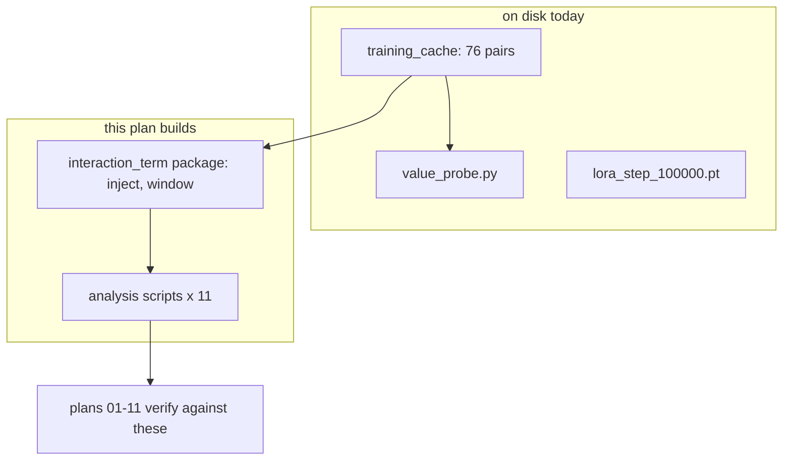

# 🔧 Build the instruments the rest of this scope measures with

## Description
Write and smoke-test the code that plans 01-11 assume already exists: the
`interaction_term` package (`inject`, `window`) and the analysis scripts each
later plan verifies itself against. Nothing here produces a result for the
paper. It produces the tools that produce the results.

## Purpose
Plans 01-11 were authored with concrete Engagement Instructions that run real
commands. Eleven of the twelve commands they check refer to files that do not
exist, so every one of those plans currently fails at its first step. This plan
closes that gap once, in one place, in the order the later plans need them.

Written 2026-08-04 after a check found the gap. Serves every DoD item indirectly
by making the checks in 01-11 executable.

## Goal
Every command in the Engagement Instructions of plans 01-11 runs and either
succeeds or fails for a real reason (missing data, a genuine result), never
`No such file or directory`. Each instrument is smoke-tested on one cached pair
before the plan that depends on it starts.

## Illustrations
What exists today versus what these plans read.



## Environment Facts This Plan Depends On
- Cache lives at `/datasets/mmolefe/poe_repair_min/outputs/training_cache/`,
  18 train pairs + 58 held-out = 76. Each cell is
  `<split>/<pair_slug>/seed_<n>/` holding `embeddings.pt`, `meta.json`,
  `mono.png`, `poe.png`, and `residuals/step_000.pt` … `step_049.pt`.
- Each residual file holds `x_t`, `eps_a_raw`, `eps_b_raw`, `eps_j_raw`,
  `eps_uncond`, all `[1,4,128,128]` **fp16**, plus int `timestep` and
  `step_index`. Upcast to fp32 before computing any norm.
- `meta.json` carries `branch_order = [a, b, j, uncond]`, `guidance_scale 7.5`,
  50 inference steps, 1024x1024, and the full `timesteps` list.
- co3 python: `/home-mscluster/mmolefe/miniforge3/envs/co3/bin/python`.
- Writes go to `/datasets`, never `/home-mscluster` (disk guard).
- Instrument smoke tests run in-session on the current node. No job needed.
  Only the sweeps in later plans need biggpu or bigbatch.
- The checkpoint used downstream is
  `artifacts/scopes/animals-compose-transfer/pooled_lora/phase1_r8_100k/checkpoints/lora_step_100000.pt`
  (via compat symlink at the old `outputs/animals_compose_transfer/...` path).
  Its 420 LoRA tensors sit under `sd["lora_state"]`, **not** at the top level.

## Tasks
- [ ] ⚠️ `scripts/cache_smoke.py`: scan all 76 pairs, check per-file keys,
      shapes `[1,4,128,128]`, dtype fp16, and NaN. Print `76/76 ok` or name
      every bad file. Needed by plan 01.
- [ ] ⚠️ `poe_repair/experiments/interaction_term/__init__.py` + a shared
      `cache.py` loader: given pair slug and seed, return the residual stack
      upcast to fp32, with `r_t = eps_j_raw - eps_poe` computed one way, in one
      place, so every downstream script agrees on what r_t means.
- [ ] ⚠️ `interaction_term/inject.py`: re-run sampling with `r_t` added back at
      dose λ. Must support `--lambda 0 --check-canary` and print
      `canary ok, delta < 1e-5`, meaning λ=0 reproduces plain PoE. Needed by 03.
- [ ] ⚠️ `interaction_term/window.py`: inject only inside a step window. Must
      support `--window off --check-identity` and be byte-identical to PoE.
      Needed by 04.
- [ ] ⚠️ Analysis scripts for plan 05, each printing its headline number:
      `snr_collapse.py` (collapse spread %), `fork_curve.py` (elbow step),
      `climb.py` (PoE vs Mono distributions), `spectrum.py` (energy-at-k plus
      held-out projection).
- [ ] ⚠️ Analysis scripts for plans 03/04/06/07: `plot_dose_curves.py`,
      `plot_window_curves.py`, `language_probes.py`, `quality_control.py`,
      `manifold_slide.py`, `composition_scatter.py`.
- [ ] ⚠️ Smoke each instrument on one cached pair (`a_cat__x__a_dog`, seed 9)
      and record the output in `docs/instrument_smoke.md`.

## Success/Failure Outcomes
- **cache smoke**
  - Success: `76/76 ok`, zero unreadable files, all four eps keys present at
    `[1,4,128,128]` fp16 in every step file.
  - Failure: a named file with missing keys or NaNs. List it and quarantine it.
    Never silently skip: a quietly dropped cell biases every later average.
- **inject canary (λ=0)**
  - Success: `delta < 1e-5` against plain PoE. This is the test that the
    injection path is wired correctly, and it must pass before any dose sweep.
  - Failure: non-zero delta at λ=0 means the injection changes the sampler even
    when it should do nothing. Every dose number after that is meaningless. Fix
    before proceeding.
- **window identity (window off)**
  - Success: byte-identical to PoE.
  - Failure: same reasoning as the canary. Stop.
- **the analysis scripts**
  - Success: each runs on one pair and prints its headline number.
  - Failure: a script that only runs on the full grid is not smoke-tested. Give
    every script a single-pair path.

## Recommended skill
▶ `/write-tests` ⚠️ for the two canaries (λ=0 and window-off): they are the
   checks the causal claim rests on, so they earn real tests, not a one-off run.
▶ `/demonstrate` ⚠️ after the smoke pass: show one cached pair's r_t alongside
   its norm, so the quantity is visible before anything is built on it.

## Engagement Instructions
```bash
PY=/home-mscluster/mmolefe/miniforge3/envs/co3/bin/python

# every instrument exists
for f in cache_smoke plot_dose_curves plot_window_curves snr_collapse \
         fork_curve climb spectrum language_probes quality_control \
         manifold_slide composition_scatter; do
  test -f "scripts/$f.py" || echo "MISSING scripts/$f.py"
done                                    # expect: no output
$PY -c "import poe_repair.experiments.interaction_term.inject, \
                poe_repair.experiments.interaction_term.window"  # expect: silent

# the two canaries: the checks the causal claim rests on
$PY -m poe_repair.experiments.interaction_term.inject \
  --pair a_cat__x__a_dog --seed 9 --lambda 0 --check-canary
# expect: "canary ok, delta < 1e-5"
$PY -m poe_repair.experiments.interaction_term.window \
  --pair a_cat__x__a_dog --seed 9 --window off --check-identity
# expect: byte-identical to PoE

$PY scripts/cache_smoke.py --all         # expect: "76/76 ok"
cat docs/instrument_smoke.md             # one recorded output per instrument
```
