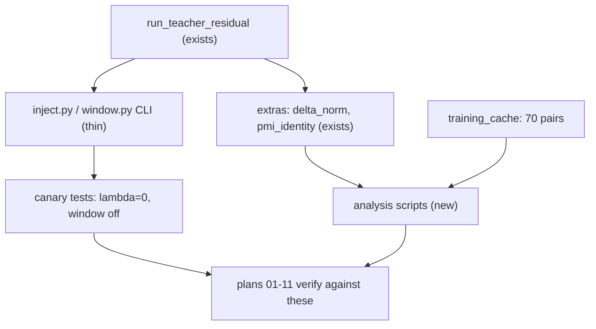

# 🔧 Wrap and verify the instruments the rest of this scope measures with

## Description
Give plans 01-11 the commands they verify themselves against. The sampler that
injects r_t at a dose and inside a window **already exists** and is already used
by the residual_diagnostics experiments. What is missing is a per-pair command
line over it, real tests for its two canaries, and the analysis scripts. This
plan adds those. It does not write a second sampler.

## Purpose
Plans 01-11 were authored assuming a `poe_repair.experiments.interaction_term`
package and eleven analysis scripts. Neither exists, so every one of those plans
fails at its first command. But the capability those plans need is not missing:
it lives under the name `teacher_residual`. Building a parallel implementation
would put a second, subtly different definition of r_t next to the one the
existing cached diagnostics were generated from, and the two would drift.

Rewritten 2026-08-05 after reading the code. The first draft of this plan
assumed the sampler had to be built; it does not.

## What already exists (read this before writing anything)
`run_teacher_residual` in `poe_repair/methods/_sampling.py:367` steps with

    ε_final = ε̃_PoE + λ_t · (ε̃_Mono − ε̃_PoE)

which is r_t injection at dose λ. Specifically, already present:

| Needed for | Already there |
|---|---|
| the dose knob (plan 03) | `lambda_max`, plus `lambda_schedule` constant / linear_decay / early_only |
| the window knob (plan 04) | `correction_window=(start, end)`, λ forced to 0 outside it (`_sampling.py:461`) |
| the definition of r_t | `delta = eps_j - eps_poe` (`_sampling.py:507`), one place |
| the ‖r_t‖ curve (plan 05) | `extras["delta_norm_per_step"]`, recorded every run |
| r_t is the interaction term | `extras["pmi_identity_residual_per_step"]`: per-step relative error of `Δ_t == w·(ε_J + ε_∅ − ε_A − ε_B)`, already computed |
| a λ grid | `experiments/residual_diagnostics/sweep.py`, eleven points 0.0 … 1.0 |
| cached r_t on disk | `artifacts/diagnostics/residual_diagnostics/delta_structure_unguided/tensors.pt` |

Two facts that decide how the canaries must be written:

- At `lam == 0.0` the loop takes the `eps_t = eps_poe` branch directly
  (`_sampling.py:549`), not `eps_poe + 0.0 * delta`. So λ=0 is exact by
  construction. But the canary CANNOT be "bit-exact against `run_cfg_poe`":
  that sampler batches three UNet branches where this one batches four, and
  the same UNet returns different numbers per batch shape (measured 1.95e-3
  per step, compounding to 0.635 over 50 steps). Every canary holds the batch
  shape fixed at four and varies only λ.
- `correction_window=None` means "λ applies at every step", which is the
  opposite of off. **Window off is `lambda_max=0`.** Plan 04's
  `--window off --check-identity` must mean that, or it tests nothing.

## Goal
Every command in the Engagement Instructions of plans 01-11 runs and either
succeeds or fails for a real reason, never `No such file or directory`. The two
canaries are tests that can fail, not assertions in a docstring.

## Illustrations
Thin wrappers over an existing sampler, not a new one.



## Environment Facts This Plan Depends On
- Cache at `/datasets/mmolefe/poe_repair_min/outputs/training_cache/`.
  **70 distinct pairs**, not 76: there are 76 pair directories (18 train + 58
  held-out) but six slugs are cached under BOTH splits
  (a_butterfly__x__a_flower_meadow, a_cat__x__a_lion, a_dog__x__a_horse,
  a_lion__x__a_dog, a_tiger__x__a_dog, a_wolf__x__a_husky), so anything
  averaging per-pair over the directory listing double-counts those six.
  Cell:
  `<split>/<pair_slug>/seed_<n>/` with `embeddings.pt`, `meta.json`,
  `mono.png`, `poe.png`, `residuals/step_000.pt` … `step_049.pt`.
- Residual file keys: `x_t`, `eps_a_raw`, `eps_b_raw`, `eps_j_raw`,
  `eps_uncond`, all `[1,4,128,128]` **fp16**, plus int `timestep`,
  `step_index`. Upcast to fp32 before any norm.
- The sampler's own `save_residuals_dir` payload is a **superset** of these
  (adds `seq_a`, `pool_a`, `seq_b`, `pool_b`, `delta`, `guidance_scale`, and
  with `save_x0_estimates` also `eps_poe`, `eps_j`). Read the cache for
  cache-derived analyses; do not regenerate what is already cached.
- `meta.json`: `branch_order = [a, b, j, uncond]`, `guidance_scale 7.5`,
  50 steps, 1024x1024, full `timesteps` list.
- co3 python: `/home-mscluster/mmolefe/miniforge3/envs/co3/bin/python`.
- Writes to `/datasets`, never `/home-mscluster` (disk guard).
- Cache-only analyses and the canaries run in-session on the current node.
  Anything invoking the UNet needs a GPU: biggpu, else bigbatch.
- Downstream checkpoint:
  `artifacts/scopes/animals-compose-transfer/pooled_lora/phase1_r8_100k/checkpoints/lora_step_100000.pt`.
  Its 420 LoRA tensors are under `sd["lora_state"]`, not at the top level.

## Tasks
- [x] ✅ `scripts/cache_smoke.py`: scan every cached pair; per-file keys,
      shapes `[1,4,128,128]`, dtype fp16, NaN check. Print `70/70 ok` or name
      every bad file. Cache-only, no GPU. Needed by plan 01.
- [x] ✅ `poe_repair/experiments/interaction_term/cache.py`: one loader that,
      given pair slug and seed, returns the residual stack upcast to fp32 and
      computes `r_t` **the same way the sampler does**: guided
      `eps_a/eps_b/eps_j` via `guided_eps`, `eps_poe` via `poe_eps`,
      `r_t = eps_j - eps_poe`. Import those two helpers from
      `poe_repair.methods._sampling`; do not re-derive them.
- [x] ✅ `scripts/interaction_term_inject.py`: thin CLI over
      `composers.teacher_residual.run` exposing `--pair`, `--seed`, `--lambda`,
      `--check-canary`. No new sampling logic.
- [x] ✅ `scripts/interaction_term_window.py`: same, exposing `--window
      start,end` and `--window off` (meaning `lambda_max=0`), plus
      `--check-identity`.
- [x] ✅ Canary tests in `tests/test_interaction_term_canaries.py`: 8 tests,
      all holding the UNet batch shape fixed. Each shown to fail against a
      deliberately broken sampler (two mutations, both reverted).
- [x] ✅ Cache-only analysis scripts (no GPU): `snr_collapse.py` (collapse
      spread %), `spectrum.py` (energy-at-k + held-out projection),
      `climb.py` (PoE vs Mono climb distributions).
- [x] ✅ Trajectory-reading scripts: `fork_curve.py` (elbow step). Reads the
      existing `latent_trajectory.pt` files; does not re-sample.
- [x] ✅ Remaining scripts for plans 03/04/06/07: `plot_dose_curves.py`,
      `plot_window_curves.py`, `language_probes.py`, `quality_control.py`,
      `manifold_slide.py`, `composition_scatter.py`.
- [x] ✅ Smoke each instrument on one cached pair and record the actual output
      in `docs/instrument_smoke.md`.

## Success/Failure Outcomes
- **cache smoke**
  - Success: `70/70 ok`, all four eps keys at `[1,4,128,128]` fp16 everywhere.
  - Failure: name the file, quarantine it. Never silently skip: a dropped cell
    biases every later average.
- **the loader agrees with the sampler**
  - Success: `r_t` from `cache.py` matches the sampler's `delta` in FORMULA,
    verified exactly: recomputing in fp16 the way the sampler did reproduces
    the stored tensor with zero error. The fp32 loader then differs by up to
    2.5% at the noisiest step, which is fp16 cancellation (r_t is a small
    difference of large numbers), not drift. fp32 is the better number.
  - Failure: the two definitions have drifted. Fix the loader, not the sampler.
    The sampler's definition is the one all existing diagnostics used.
- **λ=0 canary**
  - Success: the sampler steps with eps_PoE itself, checked against its own
    saved `eps_poe` (written before the injection branch) normalised by
    ‖r_t‖. Not against `run_cfg_poe`: different batch shape, see above.
  - Failure: the injection path changes the sampler when it should do nothing,
    so every dose number afterwards is meaningless. Stop.
- **window-off canary**
  - Success: bit-exact against a full-dose run whose window sits past the last
    step. Same batch shape both sides, so only the window logic can differ.
  - Failure: same reasoning. Stop.
- **canary tests can fail**
  - Success: breaking the code on purpose turns each test red.
  - Failure: a test that passes against broken code is not a check. Rewrite it.
- **analysis scripts**
  - Success: each runs on one pair and prints its headline number.
  - Failure: a script with no single-pair path cannot be smoke-tested. Add one.

## Recommended skill
▶ `/write-tests` ⚠️ for the two canaries: the causal claim rests on them.
▶ `/demonstrate` ⚠️ after the smoke pass: one pair's r_t beside its norm, so the
   quantity is visible before anything is built on it.

## Engagement Instructions
```bash
PY=/home-mscluster/mmolefe/miniforge3/envs/co3/bin/python

# every instrument exists
for f in cache_smoke snr_collapse spectrum climb fork_curve plot_dose_curves \
         plot_window_curves language_probes quality_control manifold_slide \
         composition_scatter interaction_term_inject interaction_term_window; do
  test -f "scripts/$f.py" || echo "MISSING scripts/$f.py"
done                                     # expect: no output

# cache-only, no GPU
$PY scripts/cache_smoke.py --all         # expect: "70/70 ok"

# the loader agrees with the sampler's definition of r_t
$PY -c "from poe_repair.experiments.interaction_term import cache; \
        print(cache.r_t('a_cat__x__a_dog', 9).shape)"   # expect: [50,1,4,128,128]

# the canaries, and proof they can fail
$PY -m pytest tests/test_interaction_term_canaries.py -v   # expect: all pass
cat docs/instrument_smoke.md             # one recorded output per instrument
```
