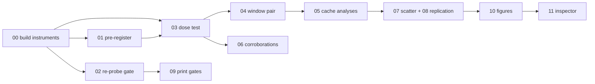

# 📏 Pre-register the correction-size measure

## Description
Choose, compute once, and write down the normalization used whenever ‖r_t‖ is
compared across pairs or prompt types, before any cross-type plot exists.

## Purpose
Raw correction size is not comparable across prompt types, and a slicing choice
in this result family already caused one retraction (the 95% Δ-field number).
Committing the measure first makes the composition-type scatter readable and
unarguable. Serves DoD 1.

## Goal
docs/normalization_preregistration.md: both candidates computed on three cached
pairs, the committed choice, dated, written before any cross-type plot is
generated.

## Illustrations
The program spine: what order, and which plans gate which.



## Environment Facts This Plan Depends On
- Cached residuals at /datasets/mmolefe/poe_repair_min/outputs/training_cache/
  are fp16: upcast to fp32 before computing norms.
- Runs in-session on the current node (mscluster85); no job needed.

## Tasks
- [ ] ⚠️ compute both candidates on 3 cached pairs (‖r_t‖/‖ε_PoE‖ and
      fraction of PoE→Mono distance), commit-window-averaged
- [ ] ⚠️ write the memo with the committed choice and date
- [ ] ⚠️ bulk-load smoke over the full cache: manifest scan, per-file keys,
      shapes, dtype, NaN check across all 76 pairs  [inferred]

## Success/Failure Outcomes
- **bulk-load smoke**
  - Success: 76 pairs scanned, zero unreadable files, all step files carry the
    four eps keys at [1,4,128,128] fp16.
  - Failure: a named file with missing keys or NaNs. List it and quarantine it;
    never silently skip.

## Recommended skill
▶ `/demonstrate` ✅ after the memo: show the two candidate numbers side by side
   on the 3 pairs and the committed line.

## Engagement Instructions
```bash
cat docs/normalization_preregistration.md    # expect a dated committed choice
PY=/home-mscluster/mmolefe/miniforge3/envs/co3/bin/python
$PY scripts/cache_smoke.py --all             # expect "76/76 ok"
```
